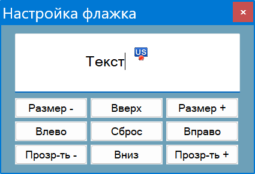
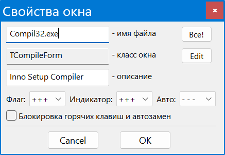
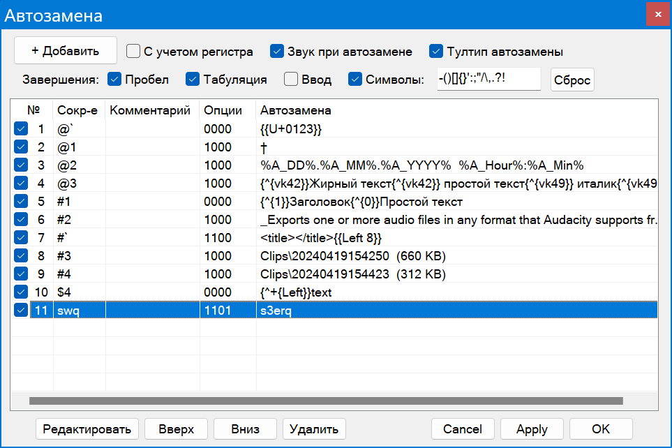
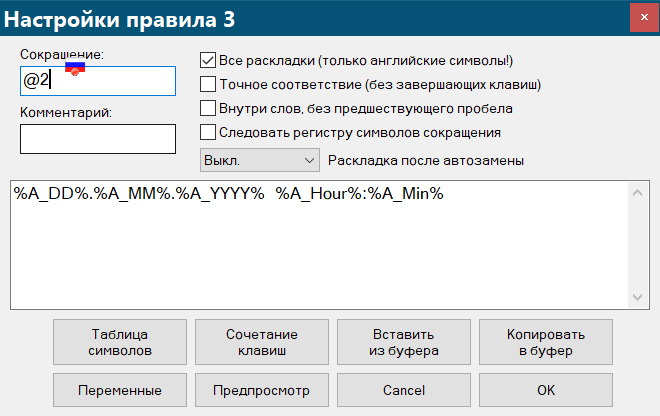

[GitHub](https://github.com/Krot66/LangBarXX)            [Ветка форума Ru.Board](http://forum.ru-board.com/topic.cgi?forum=5&topic=50256#1  "28.06.2019  21:32") 

**LangBar++** - *индикация раскладки и ее автоматическое исправление в набранном тексте*

Представляет собой средство автоматического исправления раскладки текста по мере его ввода, а также индикации текущего состояния клавиатуры у курсора, на иконке в трее и компактном неподвижном индикаторе. Имеет и  расширеннные возможности ручного преобразования, которыми можно пользоваться там, где использование автоматики затруднено. Функциональное средство для простых пользователей и тех, кто работает с множеством языков ввода.

Возможности:

- Автоматическое исправление раскладки набранного текста на основе словарей проверки орфографии Hunspell, которые могут адаптироваться и дополняться по мере необходимости используя простое средство разбора нужного тематического текста. Поддерживаются языки с мертвыми клавишами и диакритикой 
- Ручное исправление раскладки набранного текста с последовательным визуальным выделением слов или, если необходимо, символов, работающее с любыми раскладками и физическими клавиатурами. Возможность циклического преобразования между группой выбранных языков
- Флажок раскладки около каретки ввода, с настраиваемым размером, положением, прозрачностью и индикацией состояния CapsLock, плюс флажок раскладки на самом текстовом курсоре
- Иконка в трее в виде флага с отрисовкой на ней состояния кнопок NumLock и ScrollLock; сходный неподвижный индикатор раскладки и состояния клавиш, который можно разместить где угодно
- Дополнительные способы переключения раскладки, визуализация переключения на рабочем столе
- Автозамена текста с возможностью вставки форматированного текста, использованием переменных и другими дополнительными возможностями
- Дополнительные настройки клавиатуры и Lock-клавиш, изменение регистра, транслитерация и пр.

Программа отличается высокой совместимостью и низким потреблением системных  ресурсов. Может использоваться в качестве индикатора курсора и раскладки для слабовидящих.

Идет в одном исполняемом файле, осуществляющем установку и распаковку портативной версии.

Операционная система: Windows XP - 11

**&#128366; Содержание**

[TOC]

# 1. Флажок раскладки и его настройка

## 1.1 У каретки текстового ввода

<p align="center">

</p>

Отражается в полях текстового ввода - там, где имеется каретка в виде вертикального  или горизонтального штриха, обозначающего место ввода текста, и может быть определено ее положение. Имеется возможность менять относительное положение флажка мышью или масштабировать его колесиком, все с зажатым *Shift*. Можно менять прозрачность флажка прокручивая над ним колесико с зажатым *Alt* (*Alt+средняя кнопка* - значок непрозрачен). Настройки флажка всегда можно сбросить щелкнув по значку средней кнопкой мыши с зажатым *Shift*.

Если вы часто вводите текст в узкие поля, за которыми следует информация или клавиши, можно разместить флажок левее курсора. Точно так же, если у вас плохое зрение, можно попробовать разместить увеличенный флажок ниже курсора, где он не будет мешать.

Состояние *CapsLock* отображается на флажке в виде голубой тени, хорошо заметной на светлом и темном фоне. 

Флажок можно всегда быстро выключить или включить одновременным нажатием левого и правого *Shift* или из меню.

Пункт Настройка флажка* в подменю *Флажок каретки* предназначен для быстрой настройки его на ноутбуках и планшетах, где мышь отсутствует:

<p align="center">

</p>
В этом же меню имеются настройки способа его масштабирования и сглаживания. Кроме того, можно убрать подложку флажка, обеспечивающую его пиксельный контур, что позволяет использовать флажки со скругленными краями, собственной обводкой или вообще непрямоугольной формы. Также можно использовать пропорции файла флажка вместо стандартных 4:3. Оба правила применяются и к индикатору раскладки (смотри ниже).

Помимо флажков в виде картинок, возможно отображение разноцветных текстовых флажков с именами из названий раскладки, что описано [здесь](#10.1 Текстовые флажки).

## 1.2 На курсоре мыши

Флажок отображается на курсоре двух типов: текстовом (“двутавр”), какой он приобретает над полями текстового ввода, и собственно указателе мыши в виде стрелы (все остальные курсоры остаются неизменными). Флажки на этих курсорах включаются раздельно в меню *Флажок курсора*. Субъективно, лучше держать включенными обе эти опции, поскольку иначе на html-страницах, pdf-файлах и пр. происходит частая смена типа курсора, и, соответсвенно, возникает мелькание картинки. Программа сделана так, что при включении обеих опций курсор стоит на месте, а меняются только его тип.

Можно включить отображение измененного курсора лишь в случае смены активного окна и установить время его показа. В этом случае имеется опция включения флажка на курсоре при клике мышью, показывающая фажок в течении того же интервала времени.

Размер флажка настраивается в соответствующем пункте меню (приведенные размеры относятся к курсору без учета флажка). Для слабовидящих имеется пункт меню *Увеличенный флаг,* позволяющий увеличить относительный размер флажка не меняя размер самого курсора. В меню можно сменить цвет указателя, отметив соответствующий пункт и нажав и нажав *Выбор цвета.* Так же можно инвертировать указатель, чтобы он соответствовал темной теме курсоров. 

Рекомендуется выключить отображение тени курсора в *Панели управления - Мышь* для лучшего его отображения, если оно включено. Флажок курсора мыши имеет лучший вид при использовании картиночных, нетекстовых флажков. В главе 10 руководства приведена тонкая настройка флажка с помощью конфигурационного файла. Можно выключить отображение флажка на курсоре мыши запретив отображение флажка в *Правилах приложений.*

Флажок каретки и флажок курсора автоматически скрываются в полноэкранных приложениях.

# 2. Значок в трее, состояние NumLock и ScrollLock

Однократное нажатие на флажок или иконку в трее левой кнопкой мыши меняет раскладку. Состояние *NumLock* и *ScrollLock* отображается в виде двух цветных флажков на иконке в трее, при отображении которых флажок смещается вниз. Если вы привыкли работать с включенным NumLock, можно отметить в настройках пункт *Включен по умолчанию*. В этом случае включение *NumLock* будет соответствовать неизменной иконке, и клавиша будет автоматически нажиматься при запуске программы.

В меню можно выбрать пропорции иконки в трее и применить к ней настройки масштабирования и сглаживания флажка, а так же выключить ее смещение вниз при нажатии NumLock и ScrollLock.

# 3. Индикатор раскладки

Дает ту же картинку, как на иконке в трее, дополненную отображением CapsLock, по умолчанию находися в центре заголовка любого активного окна (индикатор на короткое время исчезает при перемещении окон), но может быть неподвижно поставлен в любом месте. Для его включения и выключения используется сочетание  *Ctrl+Shift+Shift* (Ctrl плюс Shift слева и справа). По умолчанию, индикатор  прозрачен для кликов, но может быть использован в качестве переключателя раскладки. При этом клик левой кнопкой переключает раскладку в прямом направлении, а клик правой - в обратном.

Настройка возможна  с помощью панели, вызываемой из меню *Индикатор* (вызвать ее можно просто зажав на секунду сочетание клавиш *Ctrl+Shift+Shift*, спрятать - нажав *Escape*).
Панель подобна той, с помощью которой можно настраивать флажок, только лишена текстового поля:

<p align="center">

</p>
В статусной строке отображаются текущие параметры отображения, при этом положение и размер выражены в процентах к размеру экрана, что дает независимость отображения индикатора при переносе портативной программы на другой компьютер. Кнопки определения положения работают с повторениями при их зажатии, так что все делается достаточно быстро. Пока открыто окно настроек, можно использовать курсорные клавиши для определения положения и те же курсорные клавиши с зажатым *Ctrl* для изменения прозрачности и размера. Пробел работает как сброс настроек.

Запретить отображение индикатора в нужных приложениях можно в окне *Правила приложений*. При настройке приожения индикатора в режиме привязки к активному окну предполагается, что вместо рабочего стола вы видите максимизированное окно, относительно которого и определяется его положение (в случае настроек по умолчанию он будет в центре заголовка окна и т. д.).

При наличии нескольких мониторов можно переместить его на другой, иначе его перемещение ограничено областью основного экрана. В случае отсоединения необходимого монитора, его положение будет восстановлено над панелью задач. При потере индикатора следует нажать кнопку “Сброс” в окне настройки - индикатор будет отображен в позиции по умолчанию. 

Индикатор всегда выключен если активным окном являются рабочий стол или панель задач, а так же при отсутствии активного окна. Так же индикатор всегда выключен в полноэкранных приложениях, если в меню не отмечен пункт “На полном экране.”

# 4. Переключение и ручное исправление раскладок

## 4.1 Переключение раскладок

Если нажать в меню на пункт *Раскладки и флажки*, появится соответствующее окно:

<p align="center">

</p>

В верхней его части отображается список используемых системой раскладок с иконками флажков в папке flags и именами соответствующих файлов изображений. Колонка *Имя* отображает сокращение раскладки, видимое на текстовых флажках и уведомлениях о переключении раскладки. Гекс-код раскладки приводится для ориентировки, он соответствует тому, с которым работает система. Последняя колонка показывает наличие словарей, нужных для автоматического исправления раскладки.

Ниже идет пункт *Использовать текстовые флажки для индикации раскладки.* Если нажать кнопку *Обновить* вы увидите эти сгенерированные флажки в списке раскладок. В случает отсутствия флажка для раскладки, она автоматически отображается текстовой, неопределенные раскладки отображаются в виде вопросительных знаков.

Чтобы изменить цвет раскладки достаточно дважды щелкнуть по соответствующей строке и выбрать цвет в стандартном диалоге. Из контекстного меню списка раскладок можно переименовать сокращение раскладки, например US на EN или En.

В разделе *Переключение раскладки*, вначале идет переключение раскладок по отдельным нумерованным сочетаниям, генерирующихся автоматически на основании номеров раскладок выше (Ctrl+1, Alt+1, Win+1 и т. д.). Также можно задать из выпадающих меню языки ввода, активирующиеся при отдельном нажатии на левые и правые кнопки Ctrl и Shift. Помимо языков ввода, на эти кнопки можно повесить и их переключение вперед и назад.

При наличии большого числа раскладок, имеет смысл использовать для переключения раскладок кнопки правый и левый Ctrl, а кнопки правый и левый Shift назначить для избранных, поскольку их кратное нажатие вызывает запуск диктора Narrator.

“Нажатие” и последующие опции относятся к типу нажатия данных клавиш, препятствующих случайному переключению раскладки. Короткое нажатие соответствует нажатию продолжительностью менее 250 миллисекунд, длинное более 600 миллисекунд. Выбор опции короткого или длинного нажатия оказывает влияние на сочетания Shift+Shift и Ctrl+Ctrl (включение флажка и автоматического исправления раскладки). Опция двойного нажатия распространяется только отдельные клавиш Ctrl и Shift. В разделе 4.7 приведены настройки продолжительности этих задержек и способ полного отключения этих горячих клавиш. 

Следующий чекбокс “Использовать имитацию клавишного переключения раскладки” позволяет предотвратить падения и зависания программ (например, 3DS Max и VNote), связанные с посылкой сообщений Post- или SendMessage, как это делают все программы и скрипты данного класса. Вместо этого посылаются обычные нажатия клавиш, такие же, как при ручном переключении (производится чуть медленнее обычного). 

Визуальное уведомление о переключении раскладки - вывод при  переключении раскладки в центре экрана полупрозрачного уведомления с сокращенным названием раскладки. Цвет настраивается, как и цвет текстового флажка, двойным щелчком на раскладке в списке выше. Следующие выпадающие меню меняют ширину в процентах к ширине экрана и его прозрачность.

Внизу окна расположены кнопки, открывающие папку флажков и настройки языков системы. Если вас не устраивает их очередность, соответствующяая последовательности переключения программой, нужно изменить их последовательность там и нажать *Обновить.*

## 4.2 Исправление раскладки набранного текста

В нижней части окна *Раскладки и флажки* мы видим настройки трех групп клавиш в виде выпадающих меню. Помимо сочетаний Pause, Capslock (включается в меню), сочетаний Shift+Backspace и Ctrl+CapsLock, можно использовать правый клик по флажку раскладки. В данном случае им всем назначены сочетания Английский-Русский для ручного исправления раскладки. Там же можно выключить сочетание полностью. Если нажать соответствующую клавишу вслед за текстом, будет происходить последовательное выделение слов, пока клавиша удерживается нажатой, всед за чем будет произведено его преобразование:

<p align="center">

</p>
Текст пригоден для такого преобразования пока не производились переключения раскладки, манипуляции мышью и нажатия нетекстовых клавиш, говорящие об окончании непрерывного ввода. Преобразование производится с учетом нажатий клавиш Backspace и последующего ввода, т. е. преобразовывается всегда видимый итоговый текст. Флажок работает как клавиша и выделяет текст пока он нажат.

Преобразование работает в командной строке, Far и терминале Windows 11, при этом из-за особенностей программ происходит забивание символов вместо их выделения:

<p align="center">

</p>
Можно всегда использовать этот абсолютно совместимый способ, например, в очень старых приложениях, с помощью сочетания  левый *Shift+Backspace* вместо правого.

Повторное нажатие клавиш после преобразования возвращает текст к исходному состоянию. Такая отмена может производиться и повторным нажатием на флажок. В любом приложении сочетание Ctrl+Z работает как отмена преобразования, если оно использовано сразу после него и включено в настройках (смотри ниже). Во всех случаях происходит переключение языка к исходному.

Тем же способом можно конвертировать и предварительно выделенный текст. Оба вида исправления раскладки работают при наборе текста внутри строки. 

> Некоторые программы автоматически заменяют введенные знаки. Например, простые кавычки заменяются на фигурные, дефисы на тире, три точки на знак многоточия и т. д.. В подобных случаях ручное исправление ==выделенного== текста оказывается невозможным!

## 4.3 Циклическое преобразование раскладки

Предполагает, что у вас имеется более двух раскладок, и вы хотите преобразовывать текст между ними последовательно нажимая клавиши. Для включения этой возможности следует выбрать там же, в выпадающих меню горячих клавиш пункт *Цикл вперед* или *Цикл назад*, соответствующих переключению раскладки в прямом и обратном направлении. Выбор языков для циклического преобразования производится с помощью чекбоксов списка раскладок в диалоге раскладки и флажки.

При первом исправлении раскладки вы выбираете текст описанным выше способом (в том числе и по словам) и преобразовываете его. Если вы хотите преобразовать текст к следующей раскладке, нужно короткое нажатие той же клавиши, и так далее, пока текст не будет преобразован к нужной раскладке. Очевидно, если вы выбрали только две раскладки, не будет никакой разницы между циклическим и простым преобразованием раскладки. Клавиша Ctrl+Z работает после любого числа преобразований, если включена. Цикл может повторяться сколько угодно.

> Если при выделении текста зажать клавишу на 0.7 секунды, циклическое преобразование текста будет производится в обратном направлении. Мигание флажка каретки говорит о достижении этого.

Обращение работает и с преобразованием правым нажатием на флажок мыши. Изменить требующийся интервал задержки можно в *Настройках выделения*

Программа запоминает текущий выбор раскладок для циклического переключения, поэтому при добавлении новой ее нужно отметить вручную, если вы хотите ее использовать.

Тем же способом можно преобразовывать и выделенный текст. При этом важно, чтобы текущий язык раскладки совпадал с языком набранного текста, что необходимо для его верной интерпретации. В случае ошибки появится тултип “Неверная раскладка!”. Это сообщение связано с отсутствием считанных символов в данной раскладке. Отсутствие сообщения не гарантирует отсутствия ошибки: при наличии языков со сходным набором символов вы можете получить неверное преобразование, так что за этим нужно следить. Возможность обращения направления преобразования  через зажим клавиш имеется и здесь.

Программа отрабатывает мертвые клавиши и диакритические знаки, набираемые с правым Alt, причем это распространяется это только на преобразование только что набранного текста. Связано это с тем, что программа записывает нажатия клавиш и возвращает их на другом языке. Когда вы преобразовываете выделенный текст, этого не происходит, поскольку полученный текст не несет достаточной для этого информации.

## 4.4 Работа с множественными раскладками

Циклическое преобразование предусмотрено для работы с несколькими языками. Что делать, если их множество? Для этого предусмотрено преобразование текста по сочетаниям клавиш, использующим номер раскладки в их списке .

Включается эта возможность в нижней части окна *Раскладки и флажки.* Можно использовать сочетания, связанные с цифровыми клавишами основной клавиатуры, можно с функциональными, или теми и другими. Так что первой раскладке соответствуют целевые клавиши *1* и *F1*, второй *2* и *F2*, и т. д.. 

Действуют следующие сочетания клавиш:

- Правый *Ctrl + целевая клавиша* - исправление раскладки стандартным способом, через выделение (как *Pause*)
- Правый *Shift + целевая клавиша* - исправление раскладки через забивание (как *Shift+Backspace*)

Работа с клавишами осуществляется так же, как в рассмотренных выше случаях, посимвольное выделение работает и здесь.

Таким образом, у вас имеются три способа ручного преобразования текста: простой (попарный), циклический (в прямом и обратном направлении) и по номерам раскладок. Их можно совмещать и комбинировать по собственному усмотрению.

Немного о раскладках и их последовательности. В окне *Раскладки и флажки* языки ввода отображаются так же, как в панели управления, их последовательность можно изменить нажав кнопку *Языки (ПУ)*, после чего следует нажать кнопку *Обновить* или перезапустить программу для применения изменений. Отклонения в видимой последовательности возможны, но всегда следует ориентироваться на то, что отображает программа в перечне раскладок.

## 4.5 Обработка табуляций и переносов

По умолчанию, табуляции и переводы строки рассматриваются как знаки начала новой записи текста. В обычных условиях это оправдано: вам ни к чему, чтобы выделение заходило на предыдущий абзац или предыдущую колонку. Программа имеет возможность корректной обработки табуляций и переводов строки, и этим можно воспользоваться, например, если вы вводите текст с большим количеством жестких переносов или табуляций. Чтобы это сделать, отметьте соответствующие пункты в меню *Выделение*.

В случае использования редактора, не позволяющего выделению по *Shift+Left* переходить на предыдущую строку (для чего предполагается использование *Shift+Up*), следует использовать сочетание <u>левый</u> *Shift+Backspace!*
Отработка табуляций не работает в редакторах, где они автоматически заменяется кратными пробелами (проверить можно включив отображение непечатаемых символов).

## 4.6 Посимвольное выделение

<p align="center">

</p>

Помимо быстрого выделения "по словам", программа предусматривает возможность посимвольного выделения (включаемого в соответствующем пункте меню *Выделение*), полезного, например, в программировании, когда вводятся текстовые значения функций. Для этого сначала посылается короткое нажатие клавиши Pause; при последующем ее нажатии будет происходить посимвольное выделение набранного текста, пока клавиша нажата, и преобразование при ее отпускании. 

Соответственно, при отсутствии отпускания будет производиться обычное выделение по словам, только начинающееся после почти незаметной задержки. 

Это работает и в случае использования *Shift+Backspace* - в этом случае *Shift* остается зажатым, а производится быстрый клик и зажатие *Backspace*. Так же при использовании номерных клавиш следует зажимать правый Ctrl или Shift и работать целевыми клавишами.

Возможно и комбинированное выделение: первое слово или несколько слов выделяется длинным нажатием клавиши, затем отпускание клавиши и повторное нажатие с посимвольным выделением. В случае прерванного выделения по словам до преобразования будет небольшая задержка (смотри ниже). Можно избежать ее, отметив опцию *Только с начала*. В этом случае посимвоьное выделение будет возможно только с нача
Посимвольное выделение работает и при нажатии правой кнопки мыши на флажок, который в этом случае будет оставаться под курсором мыши.

## 4.7 Настройка клавиатуры

Поскольку способности к печати и разбитость клавиатуры у всех разная,  в программу зашиты некие усредненные и общеприемлемые величины задержек, но сделано возможным корректировать их вручную в графическом интерфейсе, вызываемом из меню настроек:

<p align="center">

</p>

Здесь:

- Интервал выделения по словам - промежуток времени, который программа ждет прежде, чем выделить следующее слово
- Ожидание отпускания клавиши - время, которое программа ждет отпускания клавиши до начала выделения по словам в случае посимвольного выделения
- Интервал посимвольного выделения - интервал выделения символов при посимвольном выделении
- Задержка обращения цикла - время зажатия клавиши, нужное для обращения циклического выделения
- Короткое нажатие клавиш переключения - время нажатия, при котором происходит нажатие в случае выбора опции короткого переключения в диалоге *Раскладки и флажки*
- Долкое нажатие клавиш переключения - то же для долгого нажатия
- Клавиатурные сочетания - чекбоксы, в которых можно полностью выключить сочетания Ctrl+Ctrl и Shift+Shift

# 5. Изменение регистра, транслитерация

Производится подобно исправлению раскладки, настройки выделения действуют и здесь. Сочетания действуют и для выделенного текста. 

Горячие клавиши:

- Правый `Ctrl+=` - инверсия регистра
- `Shift+CapsLock` - то же (включается в меню CapsLock)
- Правый `Ctrl+-` - в нижний регистр
- Правый `Ctrl+0` - в верхний регистр
- Правый `Ctrl+9` - первые заглавные
- Правый `Ctrl+]` - транслитерация (ГОСТ 7.79-2000)

Для посимвольного выделения надо зажимать правый Ctrl и манипулировать основной клавишей. Все преобразования производятся с учетом нажатий клавиш Backspace.

Как и в других случаях, повторные нажатия всех сочетаний клавиш работают как отмена преобразования. Сочетание Ctrl+Z работает как отмена, если нажато сразу после преобразования и включено в настройках.

Инверсию регистра можно производить и нажатием средней кнопки по флажку.  Это работает как с выделенным текстом, так и с выделением при нажатии на флажок, который при этом остается на месте.

>   В немецкой и некоторых других раскладках клавиатуры сочетание `Ctrl+=` не будет работать, поскольку `=` - мертвая клавиша. Следует использовать для этого другие имеющиеся возможности.

В настройках есть опция использования CapsLock только в качестве клавиши инверсии регистра, но еще есть опция *То же и инверсия регистра,* сохраняющая ее основной функционал. При этом короткое нажатие на CapsLock меняет ее состояние, а выделение или преобразование выделенного текста начинаются только после небольшой (0.3 c) задержки. Как обычно, повторное нажатие работает как отмена преобразован.

# 6. Автоматическое исправление раскладки

Принцип работы автоматического исправления раскладки достаточно прост. При вводе символов производится параллельная сверка вводимого текста и альтернативного, какой был бы в другой раскладке, в соответствующих словарях. И если “альтернативное” слово находится в словаре альтернативной раскладки, но собственно вводимый текст отсутствует в словаре основной, производится автоматическое исправление раскладки. 

> Данная функция блокируется встроенной проверкой орфографии Windows 10-11, если она включена в настройках системы!

Работа автоматического исправления полностью независима от конкретных раскладок используемых для выбранных языков, поддерживаются кастомные и модифицированные раскладки. Точно так же, работа автоматики сравнительно независима от ручной обработки текста: ручное и автоматическое преобразование должны быть разделены пробельными символами.

О мертвых клавишах и диакритических знаках, набираемых с зажатием правого Alt или сочетания Ctrl+Alt. Программа позволяет производить обработку слов вне зависимости от того, используете ли вы их или нет. Результат будет соответствовать физическому нажатию клавиш, так что если вы ими пользуетесь, диакритика будет на месте, а если нет, будет упрощенное современное представление. При этом использование диакритики и мертвых клавиш может улучшать работу автоматики, если используются два языка со сходным написанием некоторых слов.

Еще одной возможностью, предоставляемой данным способом обработки текста, является режим одного языка, когда из группы языков производится преобразование к одному выбранному при словарном совпадении.

Программа использует словари Hunspell, использующиеся для проверки орфографии во множестве программ. Если открыть каталог программы, там есть папка *dict*, а ней подпапки с короткими именами языков, такими же, как используются для флажков в каталоге *flags* и диалоге “Раскладки и флажки”. Словари состоят из двух файлов: аффиксов, с расширением aff, где указана кодировка, правила обработки текста и форм слов, и собственно словаря с расширением dic. Вместе они составляют пару, например en_US.aff и en_US.dic для английского языка.

При выборе полной версии в процессе установки программа содержит русский, украинский, белорусский, английский, французский и немецкий словари. Если нужны другие языки, взять их можно здесь [словари LibreOffice](https://drive.google.com/drive/folders/1Xe13v0hm3nzipRkTSIcbuAaTZGIYYpP2?usp=drive_link),  или здесь: [словари Softmaker FreeOffice](https://www.freeoffice.com/ru/download/dictionaries). В первом случае архив может содержать набор словарей для разных диалектов, в последнем sox-файл надо открыть в архиваторе и распаковать.

Процедура подключения словарей проста:

1. Зайти в диалог *Раскладки и флажки*
2. Кликните правой кнопкой мыши по интересующей раскладке и выберите пункт *Открыть (создать) папку словаря*. В случае отсутствия, в папке dict каталога программы будет создана папка, одноименная с именем флажка и открыта в проводнике
3. Далее все зависит от источника словаря. В общем случае, его нужно открыть в архиваторе  (в том числе sox- или oxt- файл) и извлечь оттуда два <u>одноименных</u> файла с расширениями dic и aff, которые и следует поместить в эту папку. Если в архиве содержится множество пар словарей, следует ориентироваться на сокращения раскладок или, в худшем случае, читать ReadMe, содержащиеся в файле!
4. После следует перезапустить программу. Если теперь зайти в диалог *Раскладки и флажки* в столбце *Словарь* будет отображаться размер подключенного словаря

Предполагается, что в папке словаря имеется только одна пара aff- и dic- файлов. Если их несколько, при загрузке программы будет выведено сообщение, а использована будет та, что является первой в алфавитном порядке.

Имеющиеся словари вполне готовы к использованию; есть несколько нюансов, о которых сказано в разделе *Отладка словарей*.

> Папка словарей определяется именем раскладки, а не используемым языком. Например, если вы используете канадскую раскладку для набора французского текста, словари нужно поместить в папку fr-CA!

Горячие клавиши:

- Включение и выключение автопереключения производится из меню или одновременным нажатием левого и правого *Ctrl*. При этом внизу флажка, индикатора и иконки в трее появляется красная точка. 
- Режим одного языка (одностороннее преобразование к одному языку) - *Ctrl+Alt+правый Ctrl*. Зеленая точка внизу флажка, индикатора и иконки в трее.
- Для отмены автоматического переключения достаточно нажать *Shift+Bacspace* или *Pause*. Клавиши работают до набора пробела, работа клавиш при ручном исправлении раскладки сохранена.
- Точно так же работает для отмены преобразования и клавиша CapsLock, если она настроена на переключение раскладки
- Для отмены преобразования можно использовать и сочетание *Ctrl+Z* , если оно включено в настройках (во избежание путаницы, сочетание всегда срабатывает в английской раскладке!)

Как и в случае ручного, преобразование производится с учетом нажатий клавиш Backspace и последующего ввода.

Управление производится из меню *Автопереключение*. Помимо включения, настройки  и конвертера словарей, о которых сказано ниже, там есть:

- Папка словарей - открытие папки словарей в проводнике

- Рабочие словари - открытие всех используемых словарей в редакторе. При этом используется либо блокнот, либо редактор в одном исполняемом файле (например, AkelPad - желательна многовкладочность и работа с кодировками) или ярлык на него в папке editor программы

- Словари Hunspell - онлайн загрузка словарей для различных языков.

- История отмен - лог отмен преобразования раскладки, позволяющий отслеживать наиболее частые ошибочные срабатывания и добавлять их в пользовательский словарь

- Исключения - простой текстовый файл (user_dict.dic в каталоге настроек) в кодировке utf-8, куда записываются слова, преобразование которых запрещено, по одному на строку, причем возможны слова на разных языках. Словарь автоматически учитывается при каждом сохранении текста, так что перезапуск программы не требуется. Лучше помещать туда начальную неизменную часть слов, или, если необходимо, несколько словоформ. Исключения короче 3-х символов игнорируются!

- Статистика - простая статистика переключений, требовавшаяся при создании и доводке программы, основанная на файле transform.log в папке logs

## 6.1 Настройки автопереключения

<p align="center">

</p>

Здесь:

- Звуки автопереключения и отмены - проигрываются файлы autocorrect.wav и undo.wav в каталоге sounds

- Уведомление при автопереключении - выводит два следующих один за другим уведомления о смене языка, относящихся к старой и новой раскладке

- Отмена преобразования по Ctrl+Z - отмена всех преобразований, ручных и автоматических по данному сочетанию (выключить при наличии проблем)

- Выключение индикации на флажке - удаление красной (или зеленой) точки с флажка, индикатора и иконки в трее

- Языки автопереключения - меню пар языков установленных в системе, для которых имеются словари в каталоге dict

- Только основной словарь - использовать только основной словарь при автопереключении, исключая дополнительные

- Режим одного языка - содержит меню предпочитаемого языка, на который будет проводится автопереключение и лист языков с чекбоксами, при наборе на которых будет оно возможно. 

- Обработка текста с 3-х символов - сопоставление со словарями и преобразование происходит начиная с ввода третьего символа вместо второго, как при снятии этой опции. Это уменьшает вероятность срабатывания по случайным сочетаниям клавиш. При этом после пробела короткое слово проверяется и при необходимости преобразовывается все равно!

- Игнорировать отдельные буквы - словари Hunspell часто содержат все буквы алфавита, не несущие смысловой нагрузки. Нужно либо править словари (описано ниже), либо пользоваться этой опцией.

- Игнорировать аббревиатуры - опция может быть полезна для предотвращения срабатывания автоматики при наборе текста в верхнем регистре.

- Игнорировать слова с цифрами - позволяет исключить из обработки всевозможные буквенно-цифровые сокращения в словарях Hunspell

- Начальные границы слов
  
  - Символы - перечень символов, которые не будут считаться частью слов при преобразоваии. Например, `(цу  ` будет преобразовано в `(we`. В случае символов, меняющихся с раскладкой, предполагает, что граничный символ остается в старой раскладке, а последующая часть преобразовывается к новой. Следует с осторожностью использовать символы, на которых в другой раскладке находятся буквы. Если вы используете раскладку с мертвыми клавишами, границы слов не должны приходиться на них! 
  
  - Клавиши цифрового ряда - использовать в качестве границ слов клавиши `, 1-9, 0, -, =, в любых раскладках и комбиациях с Shift. Требования - те же, что и выше (совершенно допустимо для сочетания английский-русский).
  
  - Конечные границы слов - символы, которые в другой (!) раскладке являются символами завершения слов (знаки точки, запятые, восклицательные и вопросительные знаки и пр.). Вы вводите `vs/` и автоматически это преобразовывается в `мы.`. Опция имеет значение только для коротких слов, которые не преобразовываются ранее. В отличии от начальных границ, действие конечных не безусловно. Например `фтб` будет преобразовано в `an,`, а `шею` в `it.` - нет, из-за осмысленности сочетания знаков в основной раскладке.

- Не исправлять раскладку 
  
  - *После ручного переключения* - запрет исправления раскладки после ручного переключения или использования клавиши переключения. В последнем случае не имеет значения факт изменения языка, и если вам нужно ввести пароль или логин, достаточно перед этим нажать Ctrl или другую назначенную в диалоге *Раскладки и флажки* клавишу! Запрет работает до первого пробельного символа.
  
  - *После клика мышью* - аналогичный запрет после щелчка мышью. Работает при клике в прежнем окне набора текста и игнорируется в новых окнах.
  
  - *После нажатия Backspace* - предотвращает ошибки автоматического преобразования при редактировании (действует до первого пробела). Опция не влияет на обработку клавиш при ручном преобразовании текста.

Клавиша *По умолчанию* восстанавливает начальные настройки окна.

## 6.2 Дополнительные словари

Сначала немного о словарях Hunspell. Строки словаря имеют вид типа `воспевать/BLMP`, где вначале идет основная форма слова, а за косой чертой - часть, связанная с образованием словоформ. За счет этого русский словарь в менее 150 000 строк содержит почти 1 300 000 словоформ!

Кодировка словарей прописывается в строке, находящейся в начале aff-файлов (например, `SET ISO8859-1`), что может помочь их корректно открыть (меню *Рабочие словари* открывает и aff-файлы с этой целью).

Очевидно, штатные словари, несмотря на внушительный объем, не содержат всего необходимого. Для исправления этого предусмотрена возможность добавления дополнительных словарей, созданных из тематических текстов с помощью встроенного инструмента, о чем будет сказано ниже. Дополнительные словари работают только при подключении к основному, состоящему из двух файлов. Для нужд отладки, можно отключить дополнительные словари в настройках.

Общие требования к дополнительному словарю:

- Расширение - dic
- Кодировка - utf-8
- Одно слово на строку, без ведущих пробелов
- Отсутствие слов на других языках, разного рода мусора и  грамматических ошибок!

Структура папки dict выглядит примерно так:

```
+---en-US       
¦       en_US.aff     - файл основного словаря
¦       en_US.dic       ...
¦       dict.dic   - файл дополнительного словаря
¦
+---ru-RU
        ru_RU.aff   - файл основного словаря
        ru_RU.dic     ...
```

Для корректного обновления программы и отсутствия дубликатов желательно, чтобы основные словари отличались от названия папки заменой дефиса на черту, как это и делается в большинстве программ.

Выбранные в настройках словари загружаются при запуске программы, поэтому редактировать их можно в любой момент, но для применения изменений требуется перезапуск.

## 6.3 Конвертер словарей

Для генерации дополнительных словарей из произвольного текста, был сделан конвертер словарей, открываемый из меню Автопереключение:

<p align="center">

</p>

Слева вверху идет выбор обработки произвольного текста с возможностью ограничения минимальной длины извлекаемых слов - в противном случае произодится обработка простого построчного словаря, Hunspell или др.

Слияние и удаление дубликатов с учетом регистра - слова после слияния и обработки, включающей обрезку слов сортируются и выбраковываются с учетом регистра слов. 

Сортировка слов с учетом регистра - сначала выводятся слова в верхнем регистре для всех букв. Может быть удобно для выделения аббревиатур и собственных имен. Работает не всегда корректно с нелатинскими символами, буквы с акцентами, скорее всего, будут внизу. Со снятым чекбоксом сортировка не различает слова с акцентами или без.

Ниже идет выбор способа сохранения - в словарь программы или в отдельный файл.  В первом случае будет открыто окно выбора папки в каталоге dict программы. Вам потребуется выбрать существующую папку  или создать новую с именем существующей локали. Словарь будет сохранен в данной папке в файл с ее именем и с суффиксами вида `_1`, `_2` в случае совпадения имен. При сохранении в отдельный файл откроется окно сохранения файла с именем, использующим временную метку.

Далее идут кнопки для вставки текста из буфера обмена, через окно открытия или перетаскивания файла (в единственном или множественном числе) на нижнюю кнопку окна. Кодировка utf-8 в последнем случае необходима!

Справа расположены опции:

- Удалять акценты - убирать диакритические знаки, двоеточия и пр.

- Только слова с английскими (или русскими) буквами - выбор слов заданного языка из многоязычного текста

- Регэксп слов - регулярное выражение, которому должны удовлетворять искомые слова, что необходимо для выбора слов произвольного языка. Английским словам соответствует `^[a-zA-Z-]+$`, русским `^[а-яА-ЯёЁ-]+$`. Для других языков должно быть что-то подобное с отдельным перечислением букв с акцентами (в худшем случае придется перечислить в квадратных скобках все знаки алфавита в верхнем и нижнем регистрах). При необходимости следует добавить апострофы или другие знаки препинания, входящие в состав слов. Регулярные выражения сохраняются между сессиями в выпадающем меню.

- Обработка аббревиатур - возможность их удаления или, наоборот, исключительного сохранения в обработанном тексте. Если вам нужно вытащить все английские аббревиатуры в русском тексте, вы отмечаете опции “Только английские слова”, а также “Обработка аббревиатур” и “Только аббревиатуры” - все будет оформлено в отдельный словарь

- Все слова в нижний регистр - нужно для словарей, где верхний регистр используется для обычных слов.

- Удаление слов с цифрами - с этим все должно быть ясно

- Удаление слов с апострофами - относится к внутренним апострофам (концевые при обработке текста удаляются автоматически)

- Обрезка слов - длина слова не более 6-8 символов кажется вполне достаточной для обычных нужд. Содержимое словарей Hunspell, если они используются в качестве источника, начиная с косой черты обрезается автоматически.

После окончания обработки будет выведено итоговое окно с указанием числа слов итогового словаря, его размера и времени обработки, затем словарь будет открыт в редакторе.

Cортировка слов в словаре должна производиться по отдельным языкам (если только они не содержат общие символы), так что удалить необходимые слова должно быть несложно.

## 6.4 Отладка словарей

Ручное редактирование минимально и касается следующего:

1. Если вы использовали в качестве источника дополнительного словаря обычный текст, стоит убедиться в отсутствии возможного мусора и иностранных слов (со словарями Hunspell в этом нет нужды)

2. Второй проблемой являются отдельные буквы, часто приводимые в словарях Hunspell в полном алфавитном перечне. Из-за этого одиночные местоимения `я` или `i` перестанут работать, а ввод других одиночных символов будет вызывать переключение раскладки. Обработку одиночных букв можно отключить в настройках, либо следует очистить все, лишенное смысловой нагрузки, для чего следует ввести в строку поиска AkelPad регулярное выражение `^.(/|$)`, отметив соответствующий пункт в окне поиска, и удалить ненужное или закомментировать его, поставив в начале строки `;` (следует сделать для малых и больших букв, если они есть).

Для других нужд сделано простое средство визуализации работы программы и отладки словарей. Если нажать на флажок левой кнопкой мыши с зажатым *Ctrl* (или по сочетанию *Ctr+Shift+Alt+T*), у верхней границы экрана в центре появится тултип, по мере ввода принимающий такой вид:

```
en-US  tot tot (tot, toto)
ru-Ru  еще еще (еще)
```

В начале обеих строк идут сокращенные названия раскладок, основной и альтернативной, далее идет текст, набираемый в основной и альтернативной раскладке, затем найденный текст в словарях (если есть), здесь английском и русском, после в скобках через запятую идут найденные в словарях слова. После автопереключения индикация останавливается в состоянии, имеющемся на момент срабатывания автоматики до ввода следующего слова. Выключение данного режима производится повторным нажатием на флажок с зажатым *Ctrl*, набором горячей клавиши или перезапуском программы.

Приведенный текст соответствует воду слова “еще” в английской раскладке. Очевидно, преобразованию после ввода пробела препятствует слово “tot” в английском словаре, которое, возможно, следует закомментировать занаком “;” или удалить. При этом при наборе слова “ещё” (с акцентом) проблем не возникнет, поскольку ему будет соответствовать в английской раскладке сочетание “to`”. Точно так же, преобразованию “еру” в английское “the” препятствует словоформа слова “ер”, которой соответствует строка словаря “ер/K”. Можно закомментировать все слово, а можно только убрать “\K”, которое и ответственно за существование словоформы “еру”. В таких случаях нужно просто просмотреть сокращенные на символ слова и изменить нужное.

Подобные случаи малочисленны и относятся только к коротким словам.

# 7. Правила приложений

Интерфейс для блокировки или, наоборот, принудительного включения флажка, индикатора и автопереключения раскладки в необходимых приложениях, чтобы не было необходимости делать это вручную. Если нажать сочетание *Shift+Shift* и удержать его секунду, появится окно правил (его можно вызывать и из меню Автопереключение) с подсветкой правила для текущего окна, если оно есть, или тултипом *Нет включенных правил для данного приложения!*:

<p align="center">

</p>

Вверху имеется кнопка *Для создания правила перетащите кнопку на окно приложения*, и прежде, чем разбираться с содержимым окна, создадим правило для текущего приложения. В результате получаем окошко примерно такого содержания:

<p align="center">

</p>

Здесь под именем файла понимается исполняемый файл, связанный с окном приложения. Класс окна - это особая его характеристика, используемая для точности идентификации и исключения ошибок при совпадении имен файлов. Например, все окна современных приложений имеют класс *ApplicationFrameWindow*, а почти все браузеры и приложения, сделанные на основе Chrome, имеют класс *Chrome_WidgetWin_1*. Имеется кнопка *Все!*, с нажатием на которую вместо имени файла будет подставлена маска \*.\*, означающая, что все окна данного класса, имеющие разные исполняемые файлы, будут обрабатываться данным правилом. 

Последнее поле отображает описание файла, если оно есть (то самое, что видно на последней вкладке свойств файла в проводнике). В него можно вписать и произвольный комментарий. 

Следует обратить внимание, что звездочка может использоваться в именах файлов и для обозначения фрагментов имени, как это бывает необходимо. Например, выражение `mpc-hc*.exe` будет работать и при наличии суффикса “64”, имеющегося у 64-разрядной версии плеера MPC-HC.

Если нажать на кнопку Edit, станет возможным редактировать имя класса окна, которое в обычном состоянии затенено и недоступно для редактирования. Например, мессенджеры Viber и Telegram постоянно меняют класс окна при обновлении, и нужно просто поставить звездочку в качестве класса окна, чтобы все всегда продолжало работать.

Ниже идут выпадающие меню с названиями Флаг, Индикатор и Авто, в которых задается их поведение. Пункт меню с плюсами соответствует всегда включению, с минусами - всегда выключению, а пустой пункт - работе без изменений, в соответствии с переключателями в меню программы. 

При этом запрет отображения флажка каретки запрещает и отображение флажка курсора в данном приложении!

Еще ниже находится чекбокс *Блокировка горячих клавиш и автозамен*. Он позволяет срабатывание нежелательных клавиатурных сочетаний и автозамен в выбранном окне. Кроме того, этом случае перестают работать и нажатия на индикатор и флажок каретки. Иконка в трее отображает иконку программы в место флажка, хотя продолжает переключать языки.

>    Если у вас тормозит игра с запущенной LangBar++, попробуйте выключить все три опции (флажок, индикатор и автозамена) в окне игры. Точно так же, если вам мешают горячие клавиши программы, включите их блокировку!

Очевидно, есть две политики настройки программы: держать опции постоянно включенными, добавляя программы исключения, и постоянно выключенным, включая их в нужных приложениях; вам следует выбрать наиболее подходящую.

Теперь можно вернуться к исходному окну и тому, как оно отображает существующие правила. В первой колонке идет его номер и чекбокс, с помощью которого можно его включить или выключить. Затем идут три колонки с именем файла, класса окна и описания, и три колонки с настройками флага, индикатора и автопереключения.

Ниже списка правил размещена кнопка *Редактировать*, с помощью которой можно открыть то же окно, в котором правила создавались (его можно вызвать двойным щелчком мыши по правилу), и кнопки *Вверх, Вниз*. Когда программа считывает правила, существующие для данного приложения, она делает это сверху вниз до нахождения первого подходящего и включенного, с поставленной галкой. Поэтому если вы создали универсальное правило для окон определенного класса, но хотите выделить из него одну программу, под него подпадающую, следует создать для нее правило и поставить его выше.

# 8. Автозамена текста

Позволяет вводя по условному сокращению вводить целый фрагмент текста. Можно настроить в программе множество таких сокращений для упрощения и ускорения самых рутинных дел. Для этого обычно используются короткие сочетания символов, легко запоминающиеся мнемонически и не использующиеся при обычном наборе текста. Например, сочетание *btw* для *by the way*, *]d* для даты, *@2* для электронной почты и пр.. В отличии от горячих клавиш, здесь учитываются лишь те клавиши, которые “оставляют след на бумаге”, а дополнительные клавиши не учитываются ни по отдельности, ни в сочетаниях. 

Если запустить из меню пункт Автозамена, появится окно:

<p align="center">

</p>

Оно представляет собой список имеющихся автозамен. Список нумерованный, причем в первой колонке идет галка, с помощью которой данную автозамену можно выключить или включить вновь. Во второй колонке идет используемое сокращение, в третьей комментарий, в четвертой краткое представление опций (о чем позже), и в последней собственно вводимый вместо сокращения текст. Внизу есть кнопки для редактирования автозамен и их перемещения вверх и вниз. Помимо видимого удобства, это имеет тот смысл, что список автозамен прочесывается сверху вниз, и если есть дублирующиеся, будет исполнена та, что в списке находится выше. Кнопка *Редактирование* дает тот же эффект, что и двойной клик по выбранному правилу и выводит его настройки.

Копка *Apply* применяет все сделанные изменения и позволяет не закрывая окна, выведенного поверх всех прочих, проверить работу автозамен, при необходимости быстро внося изменения.

Под заголовком окна находится несколько опций, применяемых ко всем автозаменам. 

- *С учетом регистра* - по умолчанию выключена, и сочетания срабатывают вне зависимости от регистра введенного текста. Но при определенных условиях может возникнуть необходимость учитывать это различие, например для разного регистра замещенного текста, заглавных букв и прочего.
- *Звук при автозамене* - проигрывается звук autoreplace.wav в каталоге sounds
- *Тултип автозамены* - выводится тултип с указанием ее номера и сработавшего сочетания знаков (если включена опция работы на всех раскладках (смотри ниже) после косой черты выводится и набранное сочетание клавиш). Выводится над текстовым курсором или, если его положение не определено, в центре экрана. При “сером” чекбоксе (точка или знак минус) выводится только при зажатом ScrollLock.
- *Завершения* - в общем сслучае автозамена производится после пробела табуляции, ввода или другого значимого символа, который сохраняется после автозамены (это поведение можно отключить для каждого конкретного случая). Здесь имеются соответствующие чекбоксы, можно также уточнить их набор в соответствующем поле ввода. Кнопка *Сброс* возвращает набор символов по умолчанию.

Слева вверху находится кнопка *+Добавить*, сделанная для создания автозамен (если до добавления правила выделить строку в списке автозамен, новая будет добавлена в эту позицию, иначе она будет помещена в конец списка). Кнопка вызывает меньшее окно, сделанное для добавления и редактирования правил:

<p align="center">

</p>

В левом верхнем углу находится поле ввода сокращения, ниже расположено поле комментария, нужное при вставке сохраненного буфера обмена и многоязычных автозаменах.

Справа расположены опции, определяющие работу правила:

- *Все раскладки (только английские символы!)* - программа позволяет использовать сочетание вне зависимости от текущего языка ввода. То есть вы вводите *qwe* на английском или *йцу* на русском и это дает один и тот же результат. Поскольку здесь имеется вопрос интерпретации введенного текста, для этого можно использовать только английские символы. Если у вас множество раскладок, но вы хотите ограничить работу правила двумя, придется продублировать правило на нескольких языках.
  
  >   Если ввести в поле комментария сокращение на русском (или любом другом) и нажать Ввод, в поле сокращения будет подставлен английский эквивалент и отмечено поле *Все раскладки.* Поле комментария при этом сохранится для ориентировки.

- *Точное соответствие (без завершающих клавиш)* - правила работает без завершающих символов и курсор остается точно в конце введенного текста. Если в основном окне вы выключили все завершающие клавиши, будут работать лишь правила, в которых включена эта опция. Если поставить в сокращении конечный пробел и включить эту опцию, сокращение будет срабатывать только по пробелу, не доходя до других вариантов.

- *Внутри слов, без предшествующего пробела* - позволяет сочетанию срабатывать внутри слов, без предварительного пробела, как это предполагается по умолчанию. Это позволяет варьировать окончания каких-то длинных непрерывных фрагментов текста.

```
Пример использования последних двух опций. Если вы хотите при печати исключить пробел между конечными “ы” и “й”, вам надо создать автозамену “ы й” в “ый” и отметить эти две опции.
```

- *Следовать регистру символов сокращения* - если вы набираете в сокращении первую заглавную букву, замена тоже будет начинаться с заглавной буквы; если вы набираете все сокращение заглавными буквами, весь текст замены будет идти заглавными буквами.
  
  > С последней опцией не производится обработка переменных, задание юникодных символов, обработка горячих клавиш и завершающих действий (смотри ниже). Опция независима от настройки чувствительности к ригистру в главном окне.

- Переключение раскладки - выпадающее меню со списков языков, используемое для переключения раскладки, что нужно в случае многоязычных автозамен. Если требуемая раскладка не установлена в операционной системе, опция игнорируется.

Первые четыре опции представляются в главном окне в виде нолей или единиц в соответствующей колонке списка правил. Переключение языка отображается в той же колонке через дефис.

Внизу расположено поле ввода самого текста автозамены. Редактор простейший, и если в случае сложного текста лучше вставить его из другого приложения.

Автозамена текста срабатывает мгновенно и всегда опережает исправление раскладки, для которого нужны некоторые вычисления. Заблокировать автозамены в нужном окне можно с помощью диалога *Правила приложений.*

## 8.1 Посылка сочетаний клавиш

Помимо простого текста, возможна посылка горячих клавиш, которые позволяют менять форматирование текста, перемещать текстовы курсор, выполнять служебные команды и многое другое. Текст замены разделяется на множество участков, состоящий из простого текста и ответственных за посылку клавиш, которые исполняются один за другим.

Участки, связанные с посылкой клавиш выделяются фигурными скобками, внутри которых находятся сочетания клавиш Autohotkey.  Например, `{^{vk41}}` - сочетание Ctrl+A. Между первыми двумя фигурными скобками могут находится символы ^,+,!,#, относящиеся к модификаторам (Ctrl, Shift, Alt и Win соответственно), а также знаки < и >, при необходимости указывающие на использование левой или правой клавиши. В корне находится виртуальный код клавиши A, который позволяет идентифицировать клавишу при смене раскладки.

Чтобы пользоваться этим не нужно изучать Autohotkey, достаточно нажать в окне редактора автозамен кнопку *Сочетание клавиш*. Появится окно:

<p align="center">

</p>
В нем нужно нажать требуемое сочетание клавиш. Оно будет распознано (можно повторить это несколько раз) и требуемая замена будет отображена в правом поле она. Ввод системных или иных горячих клавиш при этом блокируется, так что вводить можно что угодно. Кнопка *Copy* копирует его в буфер обмена, автоматически заключая сочетание во внешние фигурные скобки.

Кнопка Help выводит перечень существующих клавиш и используемых модификаторов (не все они присутствуют в вашей клавиатуре - это перечень того, что вообще может быть). При этом даже отсутствующие клавиши, скорее всего, будут работать.

## 8.2 Предварительные операции

Можно быстро добавлять текст к началу или концу документа, удалять или преобразовывать стоящий до автозамены текст, что может быть удобно при необходимости быстрой правки без предварительного выделения текста. Например:

`{^{Home}}text` и `{^{End}}text` - ввод текста `text` в начале или в конце документа после сочетаний Ctr+Home или Ctrl+End

`{^+{Left}}text` - выделение предыдущего слова и ввод с затиранием слова text через посылку сочетания Ctrl+Shift+Left

`{^+{Left 2}}text` - то же для двух слов (Left повторяется дважды)

`{+{Home}}text` - выделение всего предшествующего текста строки и ввод слова с сочетанием Shift+Home

 `{^{vk41}}text` - выделение всего текста (сочетание Ctrl+A) и его замена

## 8.3 Последующие операции

Если вы вставляете какую-то конструкцию, и после вам нужно переместить текстовый курсор на сколько позиций назад, для этого можно использовать сочетание вида `{{Left n}}`, где n - число нажатий на курсовую клавишу *Left*. Например, замена

```
<title></title>{{Left 8}}
```

будет устанавливать курсор по центру для ввода названия документа. При этом следует отметить опцию точного соответствия!

Точно так же, если вам нужно укоротить вставленное на несколько знаков (например, при использовании переменной), для этого нужно вставить в нужном месте (не обязательно в конце) сочетание `{{BS n}}`, соответствующее n-кратному нажатию клавиши Backspace.

## 8.4 Форматирование горячими клавишами

Хотя программа всегда вставляет простой текст, в офисных программах и некоторых других возможен ввод форматированного текста через посылку соответствующих горячих клавиш. Например, в LibreOffice и Word вставка текста

```
{^{1}}Заголовок
{^{0}}Простой текст
```

будет форматировать 1-й заголовок за счет посылки сочетания Ctrl+1 и далее вводить простой текст с сочетанием Ctrl+0.

Точно так же, вставка

```
{^{vk42}}Жирный текст{^{vk42}} простой текст {^{vk49}}италик{^{vk49}}
```

будет вставлять жирный текст, простой текст и италик за счет посылки сочетаний Ctrl+B ({^{vk42}}) и Ctrl+I ({^{vk49}}) (в отличии от предыдущего примера, здесь нужно выключать соответствующий ввод повторной посылкой клавиш и пользоваться виртуальными кодами, поскольку значения клавиш меняются в зависимости от раскладки). 

Если теперь вернуться к предварительным операциям, то можно вместо затирания предшествующего текста произвести его форматирование. Например,

```
{+{Home}^{vk42}{End}} text
```

будет выделять строку, делать ее жирной (Ctrl+B) и переходя к концу добавлять текст (если знать соответствующее сочетание клавиш, можно быстро зачеркивать предыдущий текст). Заметьте, что здесь используются одни внешние фигурные кавычки, что допустимо, поскольку Autohotkey может обрабатывать такие последовательности клавиш. Заморачиваться этим не следует: вам нужно просто на клавиатуре нащупать необходимую последовательность клавиш и частями перенести ее в программу.

## 8.5 Юникодные символы

Все, что вы вставили в окно редактора автозамен должно воспроизводиться как есть. Если требуемые символы отсутствуют в шрифте, используемом программой, и не могут быть в ней отображены, следует задавать символы по уникальному номеру, заключив его в фигурные скобки. Для этого можно использовать таблицу символов, появляющуюся по одноименной кнопке в окне редактирования автозамен. Там следует выбрать необходимый символ и в левом нижнем углу будет отображен его номер. Например, вставка `{{U+00C4}}` будет  выводить Ä (Autohotkey вставляет символ по номеру в фигурных кавычках, и еще пара кавычек для выделения).

Если нужного нет в таблице символов, следует использовать таблицы юникодных символов или программы-каталоги, например, [Unicodia](https://mercury13.github.io/unicodia/) (среди прочего, она показывает и необходимые для отображения символов шрифты). 

Еще возможно для этих целей редактировать конфигурационный файл автозамен (смотри ниже).

## 8.6 Вставка форматированного текста

Позволяет сохранять фрагменты офисных документов в бинарных файлах, которые будут вставляться по месту при автозамене. Для этого копируем нужный фрагмент (в браузере, офисной программе, фоторедакторе и пр.) и нажимаем кнопку *Вставить из буфера* в окне редактирования автозамен. На месте вставляемого текста появится что-то вроде `Clips\20231217105704  (2.4 MB)`. Это ссылка на бинарный файл без расширения в папке Clips в каталоге программы с именем из временной метки, в котором будет сохранен буфер обмена (цифры в скобках показывают размер созданного файла для справки). При автозамене вместо ввода текста происходит вставка этого расшифрованного буфера обмена. 

Если вы копировали текст из офисной программы, в такой же или аналогичной программе он будет вставлен как есть. Если вы произведете вставку в текстовом редакторе, содержимое буфера будет преобразовано к текстовому виду с потерей форматирования, картинок и пр.. Поэтому если нужно отредактировать вставку, нужно нажать кнопку *Загрузить из буфера*, вставить и отредактировать его содержимое в подходящей программе, затем вставить вновь по кнопке *Загрузить из буфера*. 

Файлы сохраняются до тех пор, пока имеются использующие их автозамены. Они удаляются в корзину при закрытии окна после удаления соответствующей автозамены. Поэтому если вы меняете файл автозамен hotstrings.ini и хотите потом вернуться к старому, следует переименовать и папку Clips! Понять, какой файл к чему относится можно по цифрам: это год, месяц, день и время без разделительных знаков. Файлы считываются в момент вставки и не висят в памяти постоянно, их можно иметь сколько угодно.

При использовании таких автозамен имеет смысл выставить точное соответствие в настройках. Для того, чтобы быстро находить нужное в списке автозамен, следует использовать комментарий.

Формат буфера не ограничен офисными документами. Можно вставлять все, что вообще возможно копировать. Распаковка сохраненного буфера обмена размером в несолько десятков мегабайт производится почти мгновенно, так что все определяется возможностями программы, в которую вы будете его вставлять (увидеть скорость загрузки можно на тултипе кнопки *Копировать в буфер* при ее нажатии).

Вместо содержимого файла, можно скопировать его самого в проводнике и вставить в автозамену тем же способом. Это можно использовать для вставки больших картинок, файлов pdf и прочего, что в бинарном виде занимает достаточный объем. В данном случае вы копируете ссылку на файл по его пути, что занимает много меньше места. Портативность программы при этом будет нарушена!

Имеется возможность ограничиться загрузкой буфера без его вставки, что можно использовать, например, в фоторедакторах, которые, как правило, игнорируют текстовый ввод. Для этого достаточно перед словом *Clips* поставить минус. В этом случае после распаковки буфера будет выведен в центре экрана тултип, подтверждающий его загрузку.

## 8.7 Переменные Autohotkey

Возможно так же использование переменных Autohotkey, сходных с переменными окружения Windows. Кнопка *Переменные* окна редактирования автозамен открывает в браузере короткую справку по ним. Подобно переменным окружения, эти переменные всегда должны заключаться в знаки процента с двух сторон. Например, строка

```
%A_DD%.%A_MM%.%A_YYYY%  %A_Hour%:%A_Min%
```

будет вставлять текст вида `08.12.2023  16:52`. 

Изменяя написание переменной в верхнем, нижнем регистре или со строчными буквами можно менять регистр текста автозамены, связанный с данной переменной.

Если переменная не определена, она заменяется пустой строкой. Это поведение можно изменить, поменяв значение переменной empty_var в секции Main файла hotstrings.ini в каталоге настроек, прописав там замену.

Кнопка *Предпросмотр* предназначена для того, чтобы увидеть вводимый текст с значениями переменных, имеющимися на данный момент. 

## 8.8 Встроенные переменные LangBar++

Наряду со штатными переменными Autohotkey, возможно использование собственных переменных программы, сделанных в том числе для быстрого извлечения информации из внешних окон, контролов, получения цвета под курсором и кодов клавиатуры. Имена переменных начинаются на L вместо A в случае переменных Autohotkey. Переменные можно проверить в окне предпросмотра, где их определение перезапускается кнопкой *Обновить* или клавишей F5.

- L_Clipboard - подставляет текущее значение текстового буфера обмена. Может использоваться для обрамления текста и т. п.. Кроме того, переменная возвращает очищенный от форматирования текст! Для отсутствия проблем, буфер обрезается до 200 символов.

Переменные, требующие клика мышью по интересующему окну, его контролу или месту (выбор окна производиться мышью или по Alt+Tab). Выводится сообщающий об этом тултип, действие должно быть произведено в ближайшие 10 секунд. 

- L_MouseX и L_MouseY - координаты курсора мыши, отмеренные от верхнего левого окна экрана (далее это предполагается везде)
- L_CaretX и L_CaretY - координаты каретки ввода. Работает всюду, где программа может отобразить флажок каретки (предполагается, что вы кликаете по заголовку окна не меняя позицию каретки)
- L_WindowX, L_WindowY, L_WindowW и L_WindowH - позиция окна под курсором мыши, его ширина и высота
- L_WindowTitle - заголовок окна под курсором мыши
- L_WindowClass - класс окна под курсором мыши
- L_ControlName - имя контрола под курсором мыши
- L_ControlText - текст в контроле под курсором мыши (первые 200 символов)
- L_ColorRGB - цвет под курсором в шестнадцатиричном RRGGBB формате без префикса (должен включаться в автозамену, если нужен)
- L_ColorBGR - то же в формате BBGGRR
- L_WebAddress - веб-адрес браузерного окна под курсором мыши (поддерживаются браузеры на основе Chrome, Firefox 58+, а также Internet Explorer и Opera Presto, где это возможно без посылки горячих клавиш).

Переменные, требующие нажатия соответствующей клавиши. Выводится сообщающий об этом тултип, действие должно быть произведено в ближайшие 5 секунд.

- L_VirtualCode - возвращает виртуальный код клавиши в виде гекс-кода без префиксов (vk, 0x), которые должны прописываться в автозамене. 
- L_ScanCode - возвращает скан-код нажатой клавиши в гекс-формате
- L_KeyName - возвращает имя нажатой клавиши. Нужно для определения названий служебных клавиш, в случае строчных выводит ее имя в английской раскладке

Как и в случае переменных Autohotkey, изменение написания переменной меняет регистр выводимого текста, включая начало с заглавной буквы. Это можно использовать, например, для преобразования гекс-значений, всегда возвращаемых в верхнем регистре.

## 8.9 Ручное редактирование автозамен

Настроенные автозамены сохраняются в файле *hotstrings.ini* в папке конфигурации программы (можно открыть в меню Помощь). Файл можно править вручную когда программа не запущена.

Если его открыть, можно увидеть задание примерно в таком виде:

```ini
[4] ;номер задания
enabled=1 ; его включенность (галка в списке)
hotstring="@2" ; сочетание знаков
comment="дата-время" ; комментарий
options="1000" ; опции
replacement="%A_DD%.%A_MM%.%A_YYYY%  %A_Hour%:%A_Min%" ; замена
```

Следует иметь ввиду, что табуляции и переносы в замене представляются сочетаниями \`t и \`n. Файл сохраняется в кодирвке UTF-16 LE, так что если вы в подходящем редакторе наберете текст, он будет вставляться как есть.

Номера заданий не должны иметь пропусков, и если он возник, все последующее будут игнорироваться.

# 9. Особенности работы в приложенях

## 9.1 Браузеры

Современные браузеры не являются стандартным приложением Windows - по сути, это большая веб-страница, на которой нарисован интерфейс и ее содержимое. Получить положение курсора в ней можно (и то не всегда), получить же положение полос прокрутки невозможно в принципе. Поэтому при прокрутке мышью, тачпадом или масштабировании страницы флажок начинает "плыть", уходя от положения курсора. Чтобы исправить это, в программе сделано так: флажок при начале прокрутки исчезает и появляется вновь, когда снова находит позицию курсора, в том числе при нажатии левой кнопки мыши или текстовом вводе. 

Поддерживаются следующие браузеры: 

- Firefox Quantum (57+) и браузеры на его основе
- Chrome и хромоклоны (Edge, Opera, Maxthon, Vivaldi, Brave, SlimJet и др., плюс приложения Google Electron)
- "Старики" Internet Explorer и Opera Presto

## 9.2 FAR, ConEmu, командная строка и терминал

При их использовании автоматически производится забивание символов вместо выделения при использовании всех горячих клавиш. ~~Флажок в командной строке и FAR на Windows 10  появляется только при включении режима старой командной строки  (*Умолчания - Настройки - Использовать прежнюю версию консоли*)~~(в последних версиях это не работет). Отображения флажка в терминале Windows 10-11 нет, по крайней мере сейчас, преобразование набранного текста работают так же, как и повсюду. Преобразование выделенного текста невозможно, как и в командной строке, поскольку оно никак не связано с положением текстового курсора. 

ConEmu является наиболее беспроблемным инструментом на всех осях, позволяющим отображать флажок каретки и преобразовывать выделенный текст.

## 9.3 Использование на виртуальных машинах

Программа сделана так, что при запуске VirtualBox или VMware Player запущенная на хосте версия автоматически отключается и не препятствует работе программы, запущенной на виртуальной машине. На VMware Player работают все сочетания исправления раскладки, на VirtualBox можно использовать сочетание *Shift+Backspace* для исправления раскладки, *CapsLock* для инверсии регистра, исправления или переключения раскладки. 
Клавиши работы с множественными раскладками (Shift+1/Shift+F1…) должны работать на виртуальных машинах, как и переключатели Alt+№. На обоих типах виртуальных машин работает исправление раскладки и регистра с помощью флажка.

# 10. Дополнительные настройки

Далее: 

- Правка конфигурационных файлов требует выхода из программы, иначе все изменения будут потеряны! 
- Для восстановления умолчаний достаточно затереть строки настройки, в которых это произошло
- Открыть папку настроек программы можно из меню *Помощь*

## 10.1 Текстовые флажки

При желании можно произвести дополнительную настройку текстовых флажков. Для этого надо закрыть программу, открыть файл langbarxx.ini (можно найти открыв папку настроек в меню Помощь) и найти секцию ini-файла:

```ini
[TextFlags]
Font_Size=36 ; размер шрифта
Bold=1 ; жирность шрифта (0 или 1)
Font_Color=EEEEEE ; цвет шрифта в шестнадцатиричном формате
Radius=4 ; радиус флажка, в процентах к его ширине 
Gradient=20 ; градиет яркости, в процентах
```

## 10.2 Флажки из png-файлов

Все флаги находятся в каталоге *flags* программы и должны соответствовать короткому имени раскладки в [Microsoft Windows LCID List](https://www.ryadel.com/en/microsoft-windows-lcid-list-decimal-and-hex-all-locale-codes-ids/) - именно это имя отображается в диалоге *Раскладки и флажки*. Если язык ввода редок и не входит в официальный перечень, будет использоваться имя из цифрового кода раскладки. Когда программа не находит флажка для вашей текущей раскладки в каталоге *flags*, поле рядом с номером, раскладка в трее и на флажке будет отображаться в виде текстового флага. Для добавления флажков можно использовать имеющийся в каталоге *flags* архив или найти нужное где-то еще, переименовать как требуется, поместить в каталог *flags*, и, собственно, все - достаточно перезапустить программу.

Общие требования к файлам флажков:

- Формат png
- Отсутствие прозрачных полей, почти всегда имеющихся у выложенных в сети флажков (в флажках в архиве они удалены пакетной обработкой)
- Использование флажков произвольной формы, со скругленными углами и пр. требует отключения  обводки флажка в меню и применяется сразу ко всем флажкам!
- Не слишком большой размер, обработка которого не влияет на ресурсы компьютера (штатные флажки имеют размер ~64 px)

Пропорции значка не имеют значения и меняются программой.

Кроме того:

- Нежелательно использование "объемных" флажков с тенями и пр. - простые, плоские значки в большинстве случаев выглядят лучше
- Предпочтительно использование упрощенных флажков без излишней деталировки; часто имеет смысл оставить центральную, значимую часть и обрезать остальное
- Небольшое размытие может улучшать отображение сложных флажков
- Крупные скругленные углы могут быть видны на подложке флажка при большом его размере, если не выключена обводка

## 10.3 Флажки на курсоре мыши

Имеются настройки в секции *Cursor* файла langbarxx.ini

```ini
[Cursor]
Text_Cursor=1 ; флажок на текстовом курсоре
Arrow_Cursor=1 ; на курсоре "стрела"
On_New_Window=0 ; показ при смене окна
On_Mouse_Click=0 ; показ при клике мышью
Cursor_Show=3 ; время его показа, с
Large_Flag=0 ; увеличенный флаг
Invert_Arrow=0 ; инверсия указателя
Invert_Threshold=100 ; порог яркости (0-255), при котором происходит инверсия текстового курсора на темном фоне (0 - выключение инверсии)
Cursor_Color=0 ; окрашивание курсора 
Arrow_Color=FF80FF ; цвет указателя
Cursor_Size=32 ; размер курсора из меню
Flag_Width=18 ; ширина флажка, пикселей
Flag_Height=12 ; его высота
Flag_X=6 ; горизонтальное смещение
Flag_Y=20 ; вертикальное смещение
```

Исходный курсор представляет из себя квадрат размером 32x32 пикселя, который масштабируется в соответствии с настройками в меню. Размеры и смещения приведены исходя из этого базового размера и пересчитываются при его изменении.

Прототипы курсоров находятся в папке cursors (файлы cursor.png, arrow.png и color_arrow.png) - их можно редактировать или менять по собственному усмотрению. Там же находится несколько альтернатив, отличающихся графикой и относительными размерами.

Следует иметь ввиду, что текстовый курсор имеет “горячую точку”, которой и производится действие, в центре, а курсор “стрела” - в верхнем левом углу. Смещения рассчитываются от этой точки, иначе при быстрой смене типа курсора будет происходить прыгание флажка.

Выключение инверсии курсора на темном фоне может понадобиться в случае использования текстовых курсоров с белым обрамлением.

## 10.4 Накладные элементы

В каталоге *masks* программы есть три файла, накладывающихся на иконку в трее и индикатор для обозначения состояния клавиш *NumLock* и *ScrollLock*. Названия двух из них соответствуют этим кнопкам, еще есть файл *NumScroll.png*, соответствующий случаю, когда отображение одной из кнопок отключено. Все файлы квадратного размера, что обязательно, и, большей частью, прозрачны. Их можно перерисовать заново или изменить размеры непрозрачной части, но заниматься этим стоит в основном в случае, если вы либо имеете высокий DPI системы, либо флаг страны в иконке вас вообще мало интересуют. 

Так же там есть файл CapsLock.png, предназначенный для изменения цвета тени флажка, если он вас не устраивает. Он масштабируется до размера флажка при отображении, его размеры значения не имеют. Файл Autocorrect.png является той красной точкой, что отрисовывается на иконке и флажках при автопереключении, файл SingleLang.png - зеленой точкой режима одного языка.

# 11. Установка и обновление программы, USB-версия

Программа идет в одном установочном файле, откуда возможна ее инсталляция и создание переносной версии, в том числе с помощью приложенных батников тихой установки и распаковки портативной версии. В процессе установки можно выбрать компоненты программы, включая словари, демон автоматического перезапуска при ошибках и наличие флажков.

При отсутствии прав администратора программа устанавливается в папку %LOCALAPPDATA% или Application Data на Windows XP/2003.

Портативная версия отличается от установленной наличием каталога *config*, в котором сохраняются ее настройки. В меню Справка установленной версии имеется пункт USB-версия, откуда можно сделать портативную версию с сохранением всех настроек. При этом файлы программы копируется в выбранное место, в него добавляется каталог *config* с настройками из %APPDATA%\LangBarXX.

Программа предусматривает возможность переноса настроек и необходимых файлов при установке из каталога запуска инсталлятора. Подхватываются настройки, файлы флажков и масок, а также словари hunspell  и папка сохраненных буферов обмена Clips. Таким образом, если вы имеете настроенную портативную версию (например, сделанную вышеприведенным способом) и запускаете инсталлятор из ее папки, все будет перенесено при инсталляции.

> При обновлении программы или распаковке портативной версии в тот же каталог, имеющиеся папки flags, masks и cursors сохраняются с суффиксом '_old', добавленные файлы флажков остаются на месте.

## 11.1 Сброс и бэкап настроек

Производится из главного меню программы. Сброс восстанавливает настройки по умолчанию, при этом будет сохранена копия существующих в виде пархива в папке *backup* в каталоге программы. Просто бэкап настроек производится нажатием одноименной кнопки в том же окне программы. Для перемещения папки бэкапа в другое место можно создать символическую ссылку на другую папку в каталоге программы с тем же именем (сделать это можно с помощью [Link Shell Extension](https://schinagl.priv.at/nt/hardlinkshellext/linkshellextension.html), FAR и других файловых менеджеров).

# 12. FAQ

*В. Моя игра (программа?) тормозит при запущенной LangBar++, я не могу пользоваться нужными мне сочетаниями клавиш и т. д. - что с этим делать?*
О. Зайдите в Правила приложений и выключите работу программы, полностью или частично, в окне игры, как это описано в одноименной главе руководства.

*В. Как при необходимости быстро выделить вручную, в том числе познаково, и преобразовать текст с помощью клавиатуры?*
О. Зажав Shift левой курсорной клавишей выделить текст и не отпуская его нажать BackSpace.

*В. Как убрать ставший ненужным встроенный индикатор раскладки, чтобы он не занимал место на панели задач?*
О. Панель управления - Языки - Дополнительные настройки.

В. Как увеличить размер меню операционной системы, чтобы было проще пользоваться программой?
О. Например, с помощью [Alternate Font Sizer](https://www.majorgeeks.com/files/details/alternate_font_sizer.html)

*В. В некоторых программах (AkelPad, SynWrite) флажок уплывает от курсора при наборе текста - что с этим делать?*
О. Скорее всего, это связано с масштабированием интерфейса свыше 100% в операционной системе (визуально это отражается на размытости интерфейса программы, но этого может и не быть!). Следует задать режим совместимости для высоких разрешений в соответствующей программе (Свойства ярлыка или файла - вкладка Совместимость) - тогда все станет на свои места.

*В. У меня в диалоге Раскладки и флажки есть множество лишних и неопределенных раскладок, или, наоборот, некоторые раскладки не определяются вообще - с чем это связано?*
О. Скорее всего, это связано с тем, что у вас установлено несколько методов ввода для одного языка (возможность, появившаяся в Windows 8). Программа рассчитана на использование только одной раскладки с каждым языком ввода!Исправить это возможно удалив комбинированные раскладки (это важно!) и добавив по отдельности нужные. Программа предоставляет возможности быстрого переключения раскладок, и в их сочетании нет нужды.

*В. В диалоге Раскладки и флажки отображаются не все раскладки и, соответственно, не для всех раскладок отображаются флажки, а переключение раскладок работает некорректно - с чем это может быть связано?*
О. Подобное может возникнуть из-за того, что различны наборы раскладок в ветвях реестра *HKEY_CURRENT_USER\Keyboard Layout\Preload* и *HKEY_CURRENT_USER\Software\Microsoft\CTF\SortOrder\Language*, чего быть не должно, но иногда случается. Удалите в настройках все раскладки, кроме английской и подключите снова. После выхода из системы все должно стать на свои места.

*В. Почему при использовании программы на двух мониторах с различными коэффициентами масштабирования происходит смещение флажка относительно установленного положения на неосновном мониторе?*
О. Следует изменить настройки совместимости для высоких разрешений (High DPI Aware) в свойствах исполняемого файла LangBar++ или его ярлыка.

*В. Почему запущенный в песочнице (Sandboxie и пр.) браузер не отображает флажок?*
О. Взаимодействие браузера с операционной системой искусственно ограничено и получить позицию курсора невозможно.

*В. В некоторых программах (Total Commander)* не работает автоматическое исправление раскладки - почему?
О. Здесь может быть дело в неравенстве прав, с которыми запущены LangBar++ и данная программа. Исправление работает, если обе программы запускаются с правами администратора или простого пользователя.

*В. У меня плохо работает исправление раскладки по правому клику мыши на флажке - почему?*
О. Это может быть связано с использованием внешнего менеджера жестов мыши, использующих тот же правый клик. Для устранения проблем обычно достаточно, чтобы программа запускалась уже после него, что можно сделать с помощью скриптов, планировщика или программ, например, бесплатных Anvir Task Manager или Autorun Organizer, работающих с отложенной загрузкой.

*В. Меня не устраивает обработка акцентов программой при автоматическом исправлении раскладки - что с этим делать?*
О. Правила обработки акцентов задаются в словарях Hunspell согласно существующим нормам языка в их самой либеральной трактовке. Например, в русском языке считается общепринятой замена ё на е, в белорусском - нет. Для изменений нужно либо редактировать aff-файл (смотри документацию Hunspell - флаги TRY, MAP и REP), либо искать более подходящие файлы словаря.

*В. Является ли портативная версия программы "silent", не оставляющей следов в системе?*
О. Да, пока не используется автозапуск.

*В. Как быстро заменить на LangBar++ имеющийся индикатор раскладки (Punto Switcher или другой) в Wim- или Iso-образе загрузочного дика?*
О. Следует поместить настроенную портативную версию программы на место старой и переименовать соответствующим образом ее исполняемый файл. 

# 13. Использованы при разработке

- Начальный код отображения флажка [Irbis ](http://forum.script-coding.com/viewtopic.php?id=10392&p=3)
- Gdip library by Tic
- Acc Standard Library by Sean
- Hunspell Spell library - majkinetor, jballi
- FileGetInfo and StrUnmark - Lexicos
- ChooseColor - iPhilip 
- LV_MoveRow - just me
- GetCaret - plankoe
- Free Flag Icons by [GoSquared](http://www.gosquared.com)
- Списки клавиш и переменных взяты с перевода документации Autohotkey на [Сером Форуме](https://www.script-coding.com/AutoHotkeyTranslation.html)

# 14. Ссылки

- [GitHub](https://github.com/Krot66/LangBarXX) - страница программы на GitHub
- [LangBar++](http://forum.ru-board.com/topic.cgi?forum=5&topic=50256#1  "28.06.2019  21:32") - Ветка форума Ru.Board

Статьи о программе:

- [LangBar++. Два вечных вопроса: индикация раскладки и ее исправление в набранном тексте](https://habr.com/ru/articles/735792/)
- [LangBar++. Автоматическое исправление раскладки набранного текста с использованием словарей Hunspell](https://habr.com/ea/v97sE-F3iEc-AeyOO8J_dg==~QEacn7sLlByzGY5nrAyG-qpjKaMA-EM5Mj7g05V8WAytYqlTza8_ZKVSNjATukxMRT6LMucN0fjr8_f1xJSY27MuP01PCYroBnqjrckbJr7VHhGxGvZKIk3aM6ZAVklRnbzfdIWcuLJaTIkAAqtNDPFTAY21B7ZYDT0xpSRilCs=)

Словари Hunspell:

- [Словари LibreOffice](https://drive.google.com/drive/folders/1Xe13v0hm3nzipRkTSIcbuAaTZGIYYpP2?usp=drive_link) - взяты из дистрибутива Libre Office
- [Словари Softmaker FreeOffice](https://www.freeoffice.com/ru/download/dictionaries)
- [wooorm/dictionaries: Hunspell dictionaries in UTF-8](https://github.com/wooorm/dictionaries) - сборник юникодных словарей Hunspell от wooorm
- [Apache OpenOffice Extensions](https://extensions.openoffice.org/en/search?query=dictionary) - словари MySpell для OpenOffice, совместимые с Hunspell (много старого и редкого)
