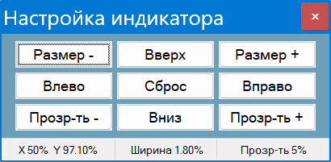
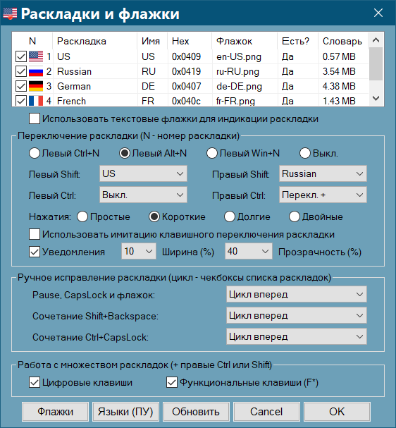
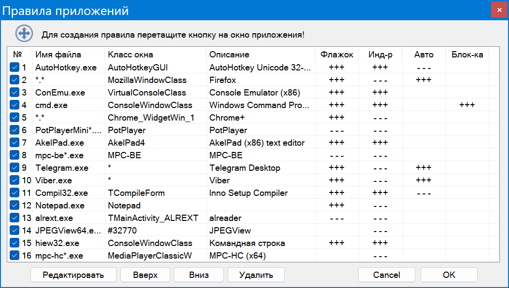

[GitHub](https://github.com/Krot66/LangBarXX)            [Ветка форума Ru.Board](http://forum.ru-board.com/topic.cgi?forum=5&topic=50256#1  "28.06.2019  21:32") 

**LangBar++** - *индикация раскладки у курсора и ее автоматическое исправление в набранном тексте*

Представляет собой средство автоматического исправления раскладки текста по мере его ввода, а также индикации текущего состояния клавиатуры у курсора, на иконке в трее и компактном неподвижном индикаторе. Имеет и  расширеннные возможности ручного преобразования, которыми можно пользоваться там, где использование автоматики затруднено. Функциональное средство для простых пользователей и тех, кто работает с большим числом языков ввода.

Возможности:

- Автоматическое исправление раскладки набранного текста на основе словарей проверки орфографии Hunspell, которые могут адаптироваться и дополняться по мере необходимости используя простое средство разбора нужного тематического текста 
- Ручное исправление раскладки набранного текста с последовательным визуальным выделением слов или, если необходимо, символов, работающее с любыми раскладками и физическими клавиатурами
- Флажок раскладки около текстового курсора, практически во всех приложениях, с настраиваемым размером, положением, прозрачностью и индикацией состояния CapsLock
- Иконка в трее в виде флага с отрисовкой на ней состояния кнопок NumLock и ScrollLock; сходный неподвижный индикатор раскладки и состояния клавиш, который можно разместить где угодно
- Иконка, флажок и индикатор генерируются из png-файлов, которые легко заменить вручную; их отрисовка возможна для любых раскладок клавиатуры
- Дополнительные настройки клавиатуры и Lock-клавиш, быстрое изменение регистра, транслитерация и пр.

Программа отличается высокой совместимостью и низким потреблением системных  ресурсов. Может использоваться в качестве индикатора раскладки для слабовидящих.

Идет в одном исполняемом файле, осуществляющем установку и распаковку портативной версии.

**Операционная система**: Windows XP - 11

[TOC]

# 1. Флажок раскладки и его настройка

<p align="center">

</p>

Отражается в полях текстового ввода - там, где имеется текстовый курсор. Имеется возможность менять относительное положение флажка мышью или масштабировать его колесиком, все с зажатым *Shift*. Можно менять прозрачность флажка прокручивая над ним колесико с зажатым *Alt* (*Alt+средняя кнопка* - значок непрозрачен). Настройки флажка всегда можно сбросить щелкнув по значку средней кнопкой мыши с зажатым *Shift*.

> Если у вас плохое зрение, можно попробовать разместить увеличенный флажок ниже курсора, где он не будет мешать. Минусами данного способа является то, положение флажка будет зависеть от используемого размера шрифта, а при использовании горизонтального курсора, как в командной строке, флажок будет смещаться ниже

Состояние *CapsLock* отображается на флажке в виде голубой тени, хорошо заметной на светлом и темном фоне. 

> Флажок можно всегда быстро выключить или включить одновременным нажатием левого и правого *Shift* или из меню.

Пункт меню *Настройка флажка* предназначен для быстрой настройки его на ноутбуках и планшетах, где мышь отсутствует:

<p align="center">

</p>
В меню флажка имеются настройки способа его масштабирования и сглаживания. Они зависят от монитора, используемых картинок флажков (с разводами и тенями или без) и их отображаемого размера. На качественных мониторах их значение невелико. По умолчанию, включено масштабирование “по ближайшему пикселю” с выключенным сглаживанием, что дает наиболее четкую картинку на мониторах посредственного качества.

Кроме того, можно убрать подложку флажка, обеспечивающую его пиксельный контур, что позволяет использовать флажки со скругленными краями, собственной обводкой или вообще непрямоугольной формы. Также можно использовать пропорции файла флажка вместо стандартных 4:3. Оба правила применяются и к индикатору флажка (смотри ниже)!

# 2. Значок в трее, состояние NumLock и ScrollLock

Однократное нажатие на флажок или иконку в трее левой кнопкой мыши меняет раскладку. Состояние *NumLock* и *ScrollLock* отображается в виде двух цветных глаз на иконке в трее, флажок на которой при этом смещается вниз. Если вы привыкли работать с включенным NumLock, можно отметить в настройках пункт "Включен по умолчанию". В этом случае включение *NumLock* будет соответствовать неизменной иконке, и клавиша будет автоматически нажиматься при запуске программы.

В меню можно выбрать пропорции иконки в трее и применить к ней настройки масштабирования и сглаживания флажка.

# 3. Индикатор раскладки

Дает ту же картинку, что и флажок, дополненную индикаторами NumLock и ScrollLock, как на иконке в трее, которая может быть неподвижно поставлена в любом месте. Для его включения и выключения используется сочетание  *Ctrl+Shift+Shift* (Ctrl слева или справа). По умолчанию индикатор прозрачен для кликов, но его можно использовать и в качестве переключателя раскладки, что включается в меню. Настройка его возможна  с помощью панели, вызываемой из меню *Индикатор* (вызвать ее можно просто зажав на секунду сочетание клавиш *Ctrl+Shift+Shift*, спрятать - нажав *Escape*).
Панель подобна той, с помощью которой можно настраивать флажок, только лишена текстового поля:

<p align="center">

</p>
В статусной строке отображаются текущие параметры отображения, при этом положение и размер выражены в процентах к размеру экрана, что дает независимость отображения индикатора при переносе портативной программы на другой компьютер. Кнопки определения положения работают с повторениями при их зажатии и ускорением перемещения После трех смещений его движение становится ускоренным (растет шаг и частота перемещений), так что все делается достаточно быстро. Пока открыто окно настроек, можно использовать курсорные клавиши для определения положения и те же курсорные клавиши с зажатым *Ctrl* для изменения прозрачности и размера.

При наличии нескольких мониторов можно переместить его на другой, иначе его перемещение ограничено областью основного экрана. В случае отключения дополнительного монитора, его положение будет восстановлено на основном (этого не произойдет если мониторов осталось более одного или после отсоединения монитора не был произведен перезапуск программы). При потере индикатора следует нажать кнопку “Сброс” - его положение будет восстановлено в центре основного экрана. 

Индикатор всегда выключен если активным окном являются рабочий стол или панель задач, а так же при отсутствии активного окна. Так же индикатор всегда выключен при активации полноэкранного приложения, если в меню не отмечен пункт “На полном экране.”

# 4. Ручное исправление раскладки

<p align="center">

</p>
Преобразование текста производится нажатием кнопки *Pause/Break* или правым щелчком по флажку индикатора раскладки. Причем конвертировать возможно не только последнее набранное слово: если оставить на короткое время клавишу или кнопку мыши зажатой, будет выделено и преобразовано предыдущее, если только не производилось переключение раскладки, манипуляции мышью и нажатия нетекстовых клавиш, говорящие об окончании непрерывного ввода. Тем же способом можно конвертировать и выделенный текст. Оба вида работают при наборе текста внутри строки.

<p align="center">

</p>
Преобразование работает в FAR, ConEmu, командной строке и терминале Windows 11, при этом из-за особенностей программ происходит забивание символов вместо их выделения. Можно всегда использовать этот абсолютно совместимый способ, например, в очень старых приложениях, с помощью сочетания *Shift+Backspace* вместо *Pause* (в диалоге “Раскладки и флажки” можно заменить этим сочетанием *Pause* постоянно.

В диалоге “Раскладки и флажки” можно включить использование для преобразования текста сочетания *Ctrl+CapsLock.*

Преобразование производится с учетом нажатий клавиш Backspace и последующего ввода, т. е. преобразовывается всегда видимый итоговый текст.

В любом приложении сочетание Ctrl+Z работает как отмена преобразования, если оно использовано сразу после него (и включено в настройках - смотри ниже)

Повторное нажатие клавиш после преобразования возвращает текст к исходному состоянию, в том числе и после набора одного пробела.

## 4.1 Посимвольное выделение

<p align="center">

</p>

Помимо быстрого выделения "по словам", программа предусматривает возможность посимвольного выделения (включаемого в соответствующем пункте настроек), полезного, например, в программировании, когда вводятся текстовые значения функций. Для этого сначала посылается короткое нажатие клавиши Pause; при последующем ее нажатии будет происходить посимвольное выделение набранного текста, пока клавиша нажата, и преобразование при ее отпускании. 

> Соответственно, при отсутствии отпускания будет производиться обычное выделение по словам, только начинающееся после почти незаметной задержки. 

Это работает и в случае использования *Shift+Backspace* - в этом случае *Shift* остается зажатым, а производится быстрый клик и зажатие *Backspace*.

Возможно и комбинированное выделение: первое слово или несколько слов выделяется длинным нажатием клавиши, затем отпускание клавиши и повторное нажатие с посимвольным выделением. В случае прерванного выделения по словам до преобразования будет небольшая задержка (смотри ниже). Можно избежать ее, отметив опцию *Только с начала*.
Посимвольное выделение работает и при использовании флажка, который в этом случае будет оставаться под курсором мыши.

Преобразование текста всегда производится после отпускания клавиши!

## 4.2 Настройка задержек выделения

Поскольку способности к печати и разбитость клавиатуры у всех разная,  в программу зашиты некие усредненные и общеприемлемые величины задержек, но сделано возможным корректировать их вручную в графическом интерфейсе, вызываемом из меню настроек:

<p align="center">

</p>

Здесь:

- Интервал выделения по словам - промежуток времени, который программа ждет прежде, чем выделить следующее слово
- Ожидание отпускания клавиши - время, которое программа ждет отпускания клавиши (посимвольное выделение) до начала выделения по словам
- Интервал посимвольного выделения - интервал выделения символов при посимвольном выделении

В случае перехода с выделения по словам на посимвольное выделение, программа ждет половину значения последней задержки отпускания клавиши, и еще столько же ее повторного нажатия.

## 4.3 Настройки переключения и исправления раскладок

Если нажать в меню на пункт *Раскладки и флажки*, появится соответствующее окно:

<p align="center">

</p>

В верхней его части отображается список используемых системой раскладок с иконками флажков и именами соответствующих файлов изображений. Гекс-код раскладки приводится для ориентировки, он соответствует тому, с которым работает система.

Ниже, в разделе *Переключение раскладки*, вначале идет переключение раскладок по отдельным нумерованным сочетаниям, вроде тех, что имеются в дополнительных настройках языков панели управления, но генерирующихся автоматически на основании номеров раскладок выше. Также можно задать из выпадающих меню языки ввода, активирующиеся при отдельном нажатии на левые и правые кнопки Ctrl и Shift. Помимо языков ввода, на эти кнопки можно повесить и переключение языков ввода “вперед” и “назад”. Если отмечен лежащий ниже чекбокс, используются двойные нажатия клавиш вместо одиночных, что позволяет избежать случайных переключений раскладки.

Следующий чекбокс “Использовать имитацию клавишного переключения раскладки” позволяет предотвратить падения и зависания программ (например, 3DS Max и VNote), связанные с посылкой сообщений Post- или SendMessage, как это делают все программы и скрипты данного класса. Можно использовать при возникновении трудностей с обычным переключением раскладки.

Приведенные выше сочетания *Pause* и *Shift+Backspace* изначально работают только с русской и английской раскладкой - они игнорируются при любом другом языке ввода. Клавиши можно выключить или переопределить для других пар языков, если воспользоваться выпадающим меню в разделе *Исправление раскладки* окна.

Кроме того, можно обменять функции клавиши *Pause* и сочетания *Shift+Backspace*, отметив соответствующий чекбокс, что сделано для ноутбуков, часто имеющих скрытую клавишу *Pause,* повешенную на сочетание с клавишей *Fn.* При этом сочетание *Shift+Backspace* будет работать с видимым выделением вместо забоя (кроме требующих этого приложений), настройки же раскладок в выпадающем меню сохранятся. 

Ниже можно включить использование сочетания *Ctrl+CapsLock* для преобразования текста как кнопки Pause.

## 4.4 Работа с множественными раскладками

В программе предусмотрена работа с тремя и более раскладками с возможностью преобразования текста меж ними. Программа способна работать не только с сравнительно тривиальными языками ввода, как русский и английский, но и теми, что используют правую клавишу *Alt* для ввода диакритических знаков и пр., как это имеет место во французской  и немецкой компьютерной клавиатуре. Если у вас имеется дополнительная раскладка для языка ввода, активизирующаяся по этой клавише, такой ввод будет обрабатываться тоже (подробнее о принципе работы программы можно прочесть в Приложении).

Очевидно в этом случае необходим соответствующий набор клавиш, связанных с каждой из имеющихся раскладок. В том же окне *Раскладки и флажки* языки ввода отображаются так же, как в панели управления, и каждой из них присвоен номер, который можно изменить, поменяв последовательность языков в панели управления, нажав кнопку *Языки (ПУ)* (после следует перезапустить программу или нажать кнопку *Обновить* для применения изменений). 

> В ранних версиях Windows можно поменять лишь язык, стоящий на первом месте с помощью выпадающего меню вверху окна. В любом случае, следует ориентироваться только на нумерацию языков в окне программы.

Имеется возможность использовать для номера целевой раскладки, к которой будет преобразован текст, два набора клавиш, которые включаются соответствующими чекбоксами: цифровые клавиши основной клавиатуры и расположенные над ними функциональные клавиши F*. Так что первой раскладке соответствуют целевые клавиши *1* и *F1*, второй *2* и *F2*, и т. д.. 

Действуют следующие сочетания клавиш:

- Правый *Ctrl + целевая клавиша* - исправление раскладки стандартным способом, через выделение (как *Pause*)
- Правый *Shift + целевая клавиша* - исправление раскладки через забивание (как *Shift+Backspace*)
- Правый *Ctrl + Shift + целевая клавиша* - переключение раскладки

Работа с клавишами осуществляется так же, как в рассмотренных выше случаях, посимвольное выделение работает и здесь. Основное отличие касается обработки выделенного текста, для интерпретации которого текущая раскладка должна совпадать с раскладкой набранного текста. Если использовались клавиши Pause, Shift+Backspace, CapsLock или правое нажатие на флажок, будет автоматически произведена попытка (в случае двух языков всегда успешная) переключения языка на второй, им назначенный; в случае же неудачи появится тултип “Неверная раскладка!”. После ручного изменения раскладки, все должно стать на свои места. Как и в случае кнопки *Pause*, при работе с командной строкой и терминалом, будет автоматически использоваться совместимый режим (правый Shift вместо правого Ctrl).

> Преобразование не работает, если при наборе текста использовались мертвые клавиши (немецкий, французский)!

## 4.5 Обработка табуляций и переносов

По умолчанию, табуляции и переводы строки рассматриваются как знаки начала новой записи текста. В обычных условиях это оправдано: вам ни к чему, чтобы выделение заходило на предыдущий абзац или предыдущую колонку. Программа имеет возможность корректной обработки табуляций и переводов строки, и этим можно воспользоваться, например, если вы вводите текст с большим количеством жестких переносов или табуляций. Чтобы это сделать, отметьте соответствующие пункты в меню *Выделение*.

>   В случае использования редактора, не позволяющего выделению по *Shift+Left* переходить на предыдущую строку (для чего предполагается использование *Shift+Up*), следует использовать сочетание *Shift+Backspace!*
>   Отработка табуляций не работает в редакторах, где они автоматически заменяется кратными пробелами (проверить можно включив отображение непечатаемых символов).

К преимуществам *Shift+Backspace* можно отнести и то, что если в редакторе включена подсветка сходных мест, выделение фрагментов текста с включенной обработкой переносов может работать некорректно.

# 5. Автоматическое исправление раскладки

Произвоводится на принципах, отличных от других распространенных программ. В основе - использование текстовых файлов с перечислением словоформ. При вводе символов производится параллельная сверка вводимого текста и альтернативного, какой был бы в другой раскладке в соответствующих словарях, и если “альтернативное” слово находится в словаре альтернативной раскладки, но собственно вводимый текст отсутствует в словаре основной, производится автоматическое переключение. Этот метод позволяет расширить языковые границы, ограниченные парой русский-английский, и перенести эти возможности на другие сочетания языков. Кроме того, он обеспечивает полную независимость от используемых раскладок, включая кастомные для установленного набора языков. 

На данный момент возможна работа с раскладками, не использующими “мертвые клавиши” для генерации символов, каковых большинство, в том числе и на территории постсовецкого пространства.

Еще одной возможностью, предоставляемой данным способом обработки текста, является режим одного языка, когда из группы языков производится преобразование к одному выбранному, если происходит словарное свпадение.

Если открыть каталог программы, там есть папка *dict*, а ней подпапки с короткими именами языков, такими же, как используются для флажков в каталоге *flags* и диалоге “Раскладки и флажки”. Внутри имеются файлы словарей *Hunspell*, используемые для проверки орфографии во множестве программ. Словари состоят из двух файлов: аффиксов, с расширением aff, где указана кодировка, правила обработки текста и формы слов, и собственно словаря с расширением dic. Вместе они составляют пару, например en_US.aff и en_US.dic для английского языка.

Строки словаря имеют вид `воспевать/BLMP`, где до косой черты идет основная форма слова, а за косой - часть, связанная с образованием словоформ. За счет этого русский словарь в менее 150 000 строк содержит почти 1 300 000 словоформ!

В первой строке aff-файла прописывается кодировка обоих файлов, например `SET ISO8859-1`, что может помочь их корректно открыть.

Помимо этого, возможно добавление собственных словарей, созданных из тематических текстов с помощью встроенного инструмента, о чем будет сказано ниже. Дополнительные словари имеют расширение dic и состоят из одного текстового файла, но работают только при подключении к основному, состоящему из двух файлов. Для нужд отладки, можно отключить дополнительные словари в настройках.

Структура папки dict выглядит примерно так:

```
+---en-US       
¦       en_US.aff     - файл основного словаря
¦       en_US.dic       ...
¦       en_US_1.dic   - файл дополнительного словаря
¦
+---ru-RU
        ru_RU.aff   - файл основного словаря
        ru_RU.dic     ...
```

<u>Имена файлов основного словаря отличаются от имени папки заменой дефиса на черту!</u>

Выбранные в настройках словари загружаются при запуске программы, поэтому для применения изменений или добавления словарей следует перезапустить программу.

Горячие клавиши:

- Включение и выключение автопереключения производится из меню или одновременным нажатием левого и правого *Ctrl*. При этом внизу флажка, индикатора и иконки в трее появляется красная точка. 
- Режим одного языка (одностороннее преобразование к одному языку) - *Ctrl+Alt+правый Ctrl*. Зеленая точка внизу флажка, индикатора и иконки в трее.
- Для отмены автоматического переключения достаточно нажать *Shift+Bacspace* или *Pause*. Клавиши работают до набора текста после пробела, работа клавиш при ручном исправлении раскладки сохранена.
- Точно так же работает для отмены преобразования и клавиша CapsLock, если она настроена на переключение раскладки
- Для отмены преобразования можно использовать и сочетание *Ctrl+Z* , если оно включено в настройках

Как и в случае ручного, преобразование производится с учетом нажатий клавиш Backspace и последующего ввода. Слово преобразуется таким, как оно выглядит на экране (можно выключить это поведение в настройках).

Управление процессом производится из меню *Автопереключение*. Помимо включения, настройки  и конвертера словарей, о которых сказано ниже, там есть:

- Папка словарей - открытие папки словарей в проводнике
- Рабочие словари - открытие всех используемых словарей в редакторе. При этом используется AkelPad, находящийся в папке editor, что связано с требование многовкладочности и плохим отображением юникодных файлов в блокноте Windows XP (можно поместить туда другой редактор в одном исполняемом файле или ярлык на него)
- История отмен - лог отмен преобразования раскладки, позволяющий отслеживать наиболее частые ошибочные срабатывания и добавлять их в пользовательский словарь
- Исключения - простой текстовый файл (user_dict.dic в каталоге настроек) в кодировке utf-8, куда записываются слова, преобразование которых запрещено, по одному на строку, причем возможны слова на разных языках. Словарь автоматически учитывается при каждом сохранении текста, так что перезапуск программы не требуется. Лучше помещать туда начальную неизменную часть слов, или, если необходимо, несколько словоформ.
- Статистика - простая статистика переключений, требовавшаяся при создании и доводке программы, основанная на файле transform.log в папке logs. Выводит среднюю и максимальную длину преобразованного текста, а так же число преобразований и процент отмен. Кроме того, показывает время поиска в словаре по мере ввода и позволяет оценить пригодность к использования программы на очень старых компьютерах.

## 5.1 Настройки автопереключения

<p align="center">

</p>

Здесь:

- Звуки при автопереключении и отмене - звук “звездочка” при исправлении раскладки и звук “стоп” при отмене

- Уведомление при автопереключении - выводит стандартное уведомление при автопереключении. Опция предназначена для Windows 10 - 11, где уведомления выезжают сбоку (на более старых операционных системах имеет вид балонной подсказки в трее). Уведомление беззвучно и совместимо с предыдущей опцией. Работает, если уведомления не отключены для LangBar++ в настройках и не включен режим “Не беспокоить”

- Отмена преобразования по Ctrl+Z - отмена всех преобразований, ручных и автоматических по данному сочетанию (выключить при наличии проблем)

- Выключение индикации на флажке - удаление красной точки с флажка, индикатора и иконки в трее

- Языки автопереключения - меню пар языков установленных в системе, для которых имеются словари в каталоге dict

- Только основной словарь - использовать только основной словарь при автопереключении 

- Режим одного языка - содержит меню предпочитаемого языка, на который будет проводится автопереключение и лист языков с чекбоксами, при наборе на которых будет оно возможно. Учитываются лишь языки, к которым имеются словари.

    > Важно: при этом необходимость в словарях других языков не отпадает, поскольку иначе будет множество ошибочных преобразований, и только постоянная сверка со словарем текущего языка может защитить от этого!

- Обработка текста с 3-х символов - сопоставление со словарями и преобразование происходит начиная с ввода третьего символа вместо второго, как при снятии этой опции. Это уменьшает вероятность срабатывания по случайным сочетаниям клавиш.

    > Данная опция не влияет на обработку коротких слов в один или два знака: как только вы вводите пробел, слово будет проверено и преобразовано при необходимости (если в ручном исправлении раскладки включена обработка переносов и табуляций, будет происходить и автопереключение после них). Недостатком является то, что если за таким коротким словом следует знак препинания, преобразование не будет произведено.

- Игнорировать отдельные буквы - словари Hunspell часто содержат все буквы алфавита, сами по себе не несущие смысловой нагрузки. Нужно либо править словари, либо пользоваться этой опцией. Кроме того, она позволяет пользоваться списками с буквенной нумерацией и пр.
  
- Начальные границы слов
  
  1. Символы - перечень символов, которые не будут считаться частью слов при преобразоваии. Например, `(цу  ` будет преобразовано в `(we`. Следует с осторожностью использовать символы, на которых в другой раскладке находятся буквы!
  2. Клавиши цифрового ряда - использовать в качестве границ слов клавиши `, 1-9, 0, -, =, в любых раскладках и комбиациях с Shift. Требования - те же, что и выше (совершенно допустимо для сочетания английский-русский).

- Конечные границы слов - символы, которые в другой (!) раскладке являются символами завершения слов (знаки точки, запятые, восклицательные и вопросительные знаки и пр.). Вы вводите `vs/` и автоматически это преобразовывается в `мы.`. Опция имеет значение только для коротких слов, которые не преобразовываются ранее. Срабатывает лишь после пробела и в том случае, если нет словарной статьи для текста, набранного в основной раскладке.
  
- Не исправлять раскладку 

  1. После ручного переключения - запрет исправления раскладки после ручного переключения или использования клавиши переключения. В последнем случае не имеет значения факт изменения языка, и если вам нужно ввести пароль или логин, достаточно перед этим нажать Ctrl или другую назначенную клавишу! Запрет работает до первого пробельного символа.
  2. После клика мышью (вставка) - аналогичный запрет после щелчка мышью. Работает при клике в прежнем окне набора текста и игнорируется в новых окнах, так что в них атопереключение остается включенным.
  3. После нажатия Backspace - предотвращает ошибки автоматического преобразования при редактировании (действует до первого пробела). Если вы забили слово, чтобы автопереключение начало работать нужен пробел! Опция не влияет на обработку клавиш при ручном преобразовании текста.

Клавиша *По умолчанию* восстанавливает изначальные настройки окна.

## 5.2 Создание словарей

Как уже было сказано, в программе используются словари на основе словарей проверки орфографии Hunspell, использующиеся во множестве программ.

Взять их можно здесь: [словари LibreOffice](https://drive.google.com/drive/folders/1Xe13v0hm3nzipRkTSIcbuAaTZGIYYpP2?usp=drive_link), [словари Softmaker FreeOffice](https://www.freeoffice.com/ru/download/dictionaries). В первом случае архив может содержать набор словарей для разных диалектов, в последнем sox-файл надо открыть в архиваторе и распаковать. Отличаются они числом личных имен, аббревиатур, сленга и использованием акцентов. Словари LibreOffice делаются под покровительством самого создателя Hunspell, поэтому в целом строже. Словари вполне готовы, в “Отладке словарей” сказано, как отредактировать слова из одной буквы, если вы не намерены отключать это в настройках.

Очевидно, словари эти, несмотря на внушительный объем, не содержат всего необходимого. Для это предусмотрена возможность создания дополнительных словарей

Общие требования к ==дополнительному== словарю программы предельно просты:

- Расширение - dic
- Кодировка - utf-8
- Одно слово на строку, без ведущих пробелов
- Естественно, отсутствие слов на других языках, разного рода мусора и  грамматических ошибок!
- Вид используемых переносов и наличие дубликатов значения не имеют

Для генерации дополнительных словарей из произвольного текста, был сделан конвертер словарей, открываемый из меню Автопереключение.

## 5.3 Конвертер словарей

<p align="center">

</p>

Слева вверху идет выбор обработки произвольного текста с возможностью ограничения минимальной длины извлекаемых слов - в противном случае произодится обработка простого построчного словаря, Hunspell или др.

Слияние и удаление дубликатов с учетом регистра - слова после слияния и обработки, включающей обрезку слов сортируются и выбраковываются с учетом регистра слов. Следует сказать, что в результате слияния и обработки словарей могут появиться дубликаты отличающиеся регистром первой буквы. Это несущественно: при загрузке словаря все не-аббревиатуры переводятся в нижний регистр, а дубликаты удаляются.

Сортировка слов с учетом регистра - сначала выводятся слова в верхнем регистре для всех букв. Может быть удобно для выделения аббревиатур и собственных имен. Работает не всегда корректно с нелатинскими символами, буквы с акцентами, скорее всего, будут внизу. Со снятым чекбоксом сортировка не различает слова с акцентами или без.

Ниже идет выбор способа сохранения - в словарь программы или в отдельный файл.  В первом случае будет открыто окно выбора папки в каталоге dict программы. Вам потребуется выбрать существующую папку  или создать новую с именем существующей локали. Словарь будет сохранен в данной папке как дополнительный с суффиксами вида `_1`, `_2` и т. д. в зависимости от наличия уже созданных ранее (созданные словари будут работать лишь при наличии основного). Во втором случае откроется окно сохранения файла с именем, использующим временную метку.

Далее идут кнопки для вставки текста из буфера обмена, через окно открытия или перетаскивания файла (в единственном или множественном числе) на нижнюю кнопку окна. Кодировка utf-8 в последнем случае необходима!

Справа расположены опции:

- Удалять акценты - то, о чем говорилось ранее в настройках и можно оставить как есть, а удалять при загрузке словаря (в Windows XP опция недоступна из-за отсутствия встроенных библиотек для этого)

- Только слова с английскими (или русскими) буквами - выбор слов заданного языка из многоязычного текста

- Регэксп слов - регулярное выражение, которому должны удовлетворять искомые слова, что необходимо для выбора слов произвольного языка. Английским словам соответствует `^[a-zA-Z-]+$`, русским `^[а-яА-ЯёЁ-]+$`. Для других языков должно быть что-то подобное с отдельным перечислением букв с акцентами (в худшем случае придется перечислить в квадратных скобках все знаки в двух регистрах). При необходимости следует добавить апострофы или другие знаки препинания, входящие в состав слов. Регулярные выражения сохраняются между сессиями в выпадающем меню.

- Обработка аббревиатур - возможность их удаления или, наоборот, исключительного сохранения в обработанном тексте. Если вам нужно вытащить все английские аббревиатуры в русском тексте, вы отмечаете опции “Только английские слова”, а также “Обработка аббревиатур” и “Только аббревиатуры” - все будет оформлено в отдельный словарь

- Все слова в нижний регистр - нужно для словарей, где верхний регистр используется для обычных слов.

- Удаление слов с цифрами - с этим все должно быть ясно

- Удаление слов с апострофами - относится к внутренним апострофам (концевые при обработке текста удаляются автоматически)

- Обрезка слов - длина слова не более 6-8 символов кажется вполне достаточной для обычных нужд. Содержимое словарей Hunspell начиная с косой черты обрезается автоматически.

После окончания обработки будет выведено итоговое окно с указанием числа слов итогового словаря, его размера и времени обработки, затем словарь будет открыт в редакторе.

Cортировка слов в словаре должна производиться по отдельным языкам (если только они не содержат общие символы), так что удалить необходимые слова должно быть несложно.

Что еще можно использовать в качестве источника специализированных словарей? Например, словари StarDict. Имеются всевозможной тематики, в этот формат конвертировано и множество сторонних словарей. Заархивированы в два или три слоя, нужно извлечь в архиваторе текстовый файл с расширением dict. Далее его следует обработать как простой текст, включить фильтрацию по языкам (или удалить лишнее после), и нужная выжимка из словаря у вас в руках!

## 5.4 Отладка словарей

Ручное редактирование минимально и касается следующего:

1. Если вы использовали в качестве источника обычный текст, стоит убедиться в отсутствии возможного мусора и иностранных слов (со словарями Hunspell в этом нет нужды)

2. Второй проблемой являются отдельные буквы, часто приводимые в полном алфавитном перечне. Из-за этого одиночные местоимения `я` или `i` перестанут работать, а ввод других одиночных символов будет вызывать переключение раскладки. Т. е. надо очистить все, лишенное смысловой нагрузки, для чего следует ввести в строку поиска AkelPad регулярное выражение `^.(/|$)`, отметив соответствующий пункт в окне поиска, и удалить ненужное или закомментировать его, поставив в начале строки `;` (следует сделать для малых и больших букв, если они есть).

Для других проблем сделано простое средство визуализации работы программы и отладки словарей. Если нажать на флажок левой кнопкой мыши с зажатым *Ctrl* (или по сочетанию *Ctr+Shift+Alt+T*), это автоматически включит автопереключение и у верхней границы экрана в центре появится тултип, по мере ввода принимающий такой вид:

```
en-US  tot tot (tot, toto)
ru-Ru  еще еще (еще)
```

В начале обеих строк идут сокращенные названия раскладок, основной и альтернативной, далее идет текст, набираемый в основной и альтернативной раскладке, затем найденный текст в словарях (если есть), здесь английском и русском, после в скобках через запятую идут найденные в словарях слова. Автоматическое переключение при этом не производится чтобы вы могли досмотреть все до конца. Выключение данного режима производится повторным нажатием на флажок с зажатым *Ctrl* или перезапуском программы.

Приведенный текст соответствует воду слова “еще” в английской раскладке. Очевидно, преобразованию после ввода пробела препятствует слово “tot” в английском словаре, которое, возможно, следует закомментировать или удалить. При этом при наборе слова “ещё” (с акцентом) проблем не возникнет, поскольку ему будет соответствовать в английской раскладке сочетание “to`”.

# 6. Правила приложений

Интерфейс для блокировки или, наоборот, принудительного включения флажка, индикатора и автопереключения раскладки в необходимых приложениях, чтобы не было необходимости делать это вручную. Если нажать сочетание *Shift+Shift* и удержать его секунду, появится окно правил (его можно вызывать и из меню Автопереключение) с подсветкой правила для текущего окна, если оно есть, или тултипом *Нет включенных правил для данного приложения!*:

<p align="center">

</p>


Вверху имеется кнопка *Для создания правила перетащите кнопку на окно приложения*, и прежде, чем разбираться с содержимым окна, создадим правило для текущего приложения. Перетаскиваем кнопку на окно и получаем окошко примерно такого содержания:

<p align="center">

</p>
Здесь под именем файла понимается исполняемый файл, связанный с окном приложения. Класс окна - это особая его характеристика, используемая для точности идентификации и исключения ошибок при совпадении имен файлов. Например, все окна современных приложений имеют класс *ApplicationFrameWindow*, а почти все браузеры и приложения, сделанные на основе Chrome, имеют класс *Chrome_WidgetWin_1*. Последнее поле отображает описание файла, если оно есть (то самое, что видно на последней вкладке свойств файла в проводнике); туда же можно вписать произвольный комментарий. Наконец имеется кнопка *Все!*, с нажатием на которую вместо имени файла будет подставлена маска \*.\*, означающая, что все окна данного класса, имеющие разные исполняемые файлы, будут обрабатываться данным правилом. 

Следует обратить внимание, что звездочка может использоваться в именах файлов и для обозначения фрагментов имени, как это часто необходимо, например, при наличии суффикса 64-разрядной версии программы (`mpc-hc*.exe` будет работать и с 64-битной версией плеера MPC).

Если нажать на кнопку Edit, станет возможным редактировать имя класса окна, которое в обычном состоянии затенено и недоступно для редактирования. Там тоже возможно использование звездочек в качестве масок. Например, мессенджер Telegram постоянно меняет класс окна, и выражение `Qt*QWindowIcon` должно будет решить эту проблему (можно и просто поставить звездочку в качестве класса окна).

Наконец, ниже идут выпадающие меню с названиями Флаг, Индикатор и Авто, в которых задается их поведение. Пункт меню с плюсами соответствует всегда включению, с минусами - всегда выключению, а пустой пункт - работе без изменений. При это включение и выключение работают безотносительно состоянию основных опций и отображению флажка, индикатора и иконки в трее!

> Очевидно, есть две политики настройки программы: держать опции постоянно включенными, добавляя программы исключения, и постоянно выключенным, включая их в нужных приложениях; вам следует выбрать наиболее подходящую.

Теперь можно вернуться к исходному окну и тому, как оно отображает существующие правила. В первой колонке идет его номер и чекбокс, с помощью которого можно его включить или выключить. Далее идут колонки, которые мы видели в окне создания правил. Затем идут три колонки с именем файла, класса окна и описания, и три колонки с настройками флага, индикатора и автопереключения.

Ниже списка правил размещена кнопка *Редактировать*, с помощью которой можно открыть то же окно, в котором правила создавались (его можно вызвать двойным щелчком мыши по правилу), и кнопки *Вверх, Вниз*. Когда программа считывает правила, существующие для данного приложения, она делает это сверху вниз до нахождения первого подходящего и включенного, с поставленной галкой. Поэтому если вы создали универсальное правило для окон определенного класса, но хотите выделить из него одну программу, под него подпадающую, следует создать для нее правило и поставить его выше!

# 7. Изменение регистра, транслитерация

Производится подобно исправлению раскладки, настройки выделения действуют и здесь. Сочетания действуют и для выделенного текста. 
Горячие клавиши:

- `Правый Ctrl+=` - инверсия регистра
- `Правый Ctrl+-` - в нижний регистр
- `Правый Ctrl+0` - в верхний регистр
- `Правый Ctrl+9` - первые заглавные
- `Правый Ctrl+]` - транслитерация (ГОСТ 7.79-2000)

Для посимвольного выделения надо зажимать правый Ctrl и манипулировать основной клавишей. Все преобразования производятся с учетом нажатий клавиш Backspace.

Как и в других случаях, сочетание Ctrl+Z работает как отмена, если нажато сразу после преобразования и включено в настройках.

Инверсию регистра можно производить и нажатием средней кнопки по флажку.  Это работает как с выделенным текстом, так и с выделением при нажатии на флажок, который при этом остается на месте.

В настройках есть опция использования CapsLock только в качестве клавиши инверсии регистра, но еще есть и возможность сохранить при этом ее основной функционал (пункт *То же и инверсия регистра*). При этом основной функционал клавиши сохраняется, а выделение или преобразование выделенного текста начинаются только после небольшой (0.3 c) задержки. Посимвольное выделение при этом возможно лишь после пробела!

Как и в случае исправления раскладки, преобразование производится после отпускания клавиши. После всех изменений регистра CapsLock находится в выключенном состоянии. Изменения регистра производятся при любых раскладках клавиатуры.

# 8. Особенности работы в приложенях

## 8.1 Браузеры

Современные браузеры не являются стандартным приложением Windows - по сути, это большая веб-страница, на которой нарисован интерфейс и ее содержимое. Получить положение курсора в ней можно (и то не всегда), получить же положение полос прокрутки невозможно в принципе. Поэтому при прокрутке мышью, тачпадом или масштабировании страницы флажок начинает "плыть", уходя от положения курсора. Чтобы исправить это, в программе сделано так: флажок при начале прокрутки исчезает и появляется вновь, когда снова находит позицию курсора, в том числе при нажатии левой кнопки мыши или текстовом вводе. 

Поддерживаются следующие браузеры: 

- Firefox Quantum (57+) и браузеры на его основе
- Chrome и хромоклоны (Edge, Opera, Maxthon, Vivaldi, Brave, SlimJet и др., плюс приложения Google Electron)
- "Старики" Internet Explorer и Opera Presto

## 8.2 FAR, ConEmu, командная строка и терминал

При их использовании автоматически производится забивание символов вместо выделения при использовании всех горячих клавиш. Флажок в командной строке и FAR на Windows 10  появляется только при включении режима старой командной строки  (*Свойства - Настройки - Использовать прежнюю версию консоли*). На Windows 11 уже и FAR запускается из терминала, поэтому чтобы видеть флажок в нем и командной строке, надо зайти в его настройки и выбрать в *Startup - Default Terminal Application Windows Console Host*.
Отображение флажка в терминале Windows 11 невозможно, по крайней мере сейчас, в остальном все работает так же, как и в командной строке. ConEmu является наиболее беспроблемным инструментом на всех осях, позволяющим отображать флажок и преобразовывать выделенный текст.

## 8.3 "Современные" (UWP) приложения

Отображение флажка не работает из-за все той же неопределимости положения каретки (как в терминале Windows, который той же породы), но преобразование раскладки работает, причем любым способом, включая Pause и сочетания Ctrl+1/F1 и пр.. 

## 8.4 Использование на виртуальных машинах

Программа сделана так, что при запуске VirtualBox или VMware Player запущенная на хосте версия автоматически отключается и не препятствует работе программы, запущенной на виртуальной машине. На VMware Player работают все сочетания исправления раскладки, на VirtualBox можно использовать сочетание *Shift+Backspace* для исправления раскладки, *CapsLock* для инверсии регистра, исправления или переключения раскладки. 
Клавиши работы с множественными раскладками (Shift+1/F1…) должны работать на виртуальных машинах, как и переключатели Alt+№. На обоих типах виртуальных машин работает исправление раскладки и регистра с помощью флажка.

# 9. Настройка флажков и визуальных элементов

Как было сказано, флажки раскладок отображаются все в том же окне *Раскладки и флажки.*

<p align="center">

</p>
В начале каждой строки находится чекбокс, если отметить который по нажатию кнопки OK флажок будет заменен на текстовый с коротким названием языка. Чтобы сменить цвет на предустановленный, надо дважды щелкнуть по интересующей строке или нажать на ввод прежде выделив ее мышью. Откроется стандартный диалог выбора цветов, в котором можно настроить нужный. Если отсутствует флажок для нужной раскладки текстовый флажок будет выбран автоматически. В случае неопределенной раскладки на флажке будут отображаться два вопросительных знака.

При желании можно произвести дополнительную настройку текстовых флажков. Для этого надо закрыть программу, открыть файл langbarxx.ini (находится в каталоге сonfig портативной версии или `C:\Users\<User>\AppData\Roaming\LangBarXX` установленной) и найти секцию ini-файла:

```autohotkey
[TextFlags]
Font_Size=36 ; размер шрифта
Bold=1 ; жирность шрифта (0 или 1)
Font_Color=EEEEEE ; цвет шрифта в шестнадцатиричном формате
Radius=12 ; радиус флажка, в процентах к его ширине 
Gradient=20 ; градиет яркости, в процентах
```

Если вы сделали что-то не то, просто выйдите из программы, удалите весь этот текст и перезапустите ее вновь - настройки будут восстановлены по умолчанию. 

Для улучшения отображения флажка можно использовать настройки масштабирования, сглаживания, масштабирование флажка и изменение пропорций иконки в

Теперь о флажках-картинках. Все флаги находятся в каталоге *flags* программы и должны соответствовать короткому имени раскладки в [Microsoft Windows LCID List](https://www.ryadel.com/en/microsoft-windows-lcid-list-decimal-and-hex-all-locale-codes-ids/). Если язык ввода редок и не входит в официальный перечень, будет использоваться имя из цифрового кода раскладки. Когда программа не находит флажка для вашей текущей раскладки в каталоге *flags*, поле рядом с номером, раскладка в трее и на флажке будет отображаться в виде вопросительного знака с фоном одного из трех цветов - синего, зеленого и красного (файлы 1.png, 2.png и 3.png в каталоге flags - можно добавить еще, если нужно, без этого они будут чередоваться). Для добавления можно использовать имеющийся в каталоге *flags* архив с флажками или найти нужное где-то еще, переименовать как требуется, поместить в каталог *flags*, и, собственно, все - достаточно перезапустить программу.

Общие требования к файлам флажков:

- Формат png
- Отсутствие прозрачных полей, почти всегда имеющихся у выложенных в сети флажков (в флажках в архиве они удалены пакетной обработкой)
- Использование флажков произвольной формы, со скругленными углами и пр. требует отключения  обводки флажка в меню и применяется сразу ко всем флажкам!
- Не слишком большой размер, обработка которого не влияет на ресурсы компьютера (штатные флажки имеют размер ~64 px)

Пропорции значка не имеют значения и меняются программой.

Кроме того:

- Нежелательно использование "объемных" флажков с тенями и пр. - простые, плоские значки в большинстве случаев выглядят лучше
- Предпочтительно использование упрощенных флажков без излишней деталировки; часто имеет смысл оставить центральную, значимую часть и обрезать остальное
- Если вы делаете текстовые флажки, используйте жирный или полужирный шрифт!
- Небольшое размытие может улучшать отображение сложных флажков
- Крупные скругленные углы могут быть видны на подложке флажка при большом его размере, если не выключена обводка

В каталоге *masks* есть три файла, накладывающихся на иконку в трее для обозначения состояния клавиш *NumLock* и *ScrollLock*. Названия двух из них соответствуют этим кнопкам, еще есть файл *NumScroll.png*, соответствующий случаю, когда отображение одной из кнопок отключено. Все файлы квадратного размера, что обязательно, и, большей частью, прозрачны. Их можно перерисовать заново или изменить размеры непрозрачной части, но заниматься этим стоит в основном в случае, если вы либо имеете высокий DPI системы, либо флаг страны в иконке вас вообще мало интересуют. 

Так же там есть файл CapsLock.png, предназначенный для изменения цвета тени флажка, если он вас не устраивает. Он масштабируется до размера флажка при отображении, его размеры значения не имеют. Файл Autocorrect.png является той красной точкой, что отрисовывается на иконке и флажках при автопереключении, файл SingleLang.png - зеленой точкой режима одного языка. 

Когда иконка меняется для отображения состояния кнопок, флаг смещается вниз чтобы остаться видимым и не быть полностью заслоненной масками. Это поведение можно изменить, выйдя из программы и поменяв параметр *Icon_Shift* в *LangBarXX.ini*. Значению `-1` будет соответствовать сдвиг иконки вверх, а `0` - ее неподвижность.

# 10. Установка и обновление программы, USB-версия

Программа идет в одном установочном файле, откуда возможна ее инсталляция и создание переносной версии, в том числе с помощью приложенных батников тихой установки и распаковки портативной версии. В процессе установки можно выбрать компоненты программы, включая словари, демон автоматического перезапуска при ошибках и флажки. 

Портативная версия отличается от установленной наличием каталога *config*, в котором сохраняются ее настройки. В меню Справка установленной версии имеется пункт USB-версия, откуда можно сделать портативную версию с сохранением всех настроек. При этом файлы программы копируется в выбранное место, в него добавляется каталог *config* с настройками из %APPDATA%\LangBarXX.

Программа предусматривает возможность переноса настроек и необходимых файлов при установке из каталога запуска инсталлятора. Подхватываются настройки, файлы флажков и масок, а также словари hunspell. Таким образом, если вы имеете настроенную портативную версию и запускаете инсталлятор из папки, все будет перенесено при инсталляции. Чтобы получить ее из установленной достаточно использовать меню Справка - USB-версия.

> При обновлении программы или распаковке портативной версии в тот же каталог, имеющиеся папки flags и masks сохраняются с суффиксом '_old', добавленные файлы флажков остаются на месте.

## 10.1 Сброс и бэкап настроек

Производится из главного меню программы. Сброс восстанавливает настройки по умолчанию, при этом будет сохранена копия существующих в виде пархива в папке *backup* в каталоге программы. Просто бэкап настроек производится нажатием одноименной кнопки в том же окне программы. Для перемещения папки бэкапа в другое место можно создать символическую ссылку на другую папку в каталоге программы с тем же именем (сделать это можно с помощью [Link Shell Extension](https://schinagl.priv.at/nt/hardlinkshellext/linkshellextension.html), FAR и других файловых менеджеров).

# 11. FAQ

*В. Как при необходимости быстро выделить вручную, в том числе познаково, и преобразовать текст с помощью клавиатуры?*
О. Зажав Shift левой курсорной клавишей выделить текст и не отпуская его нажать BackSpace.

*В. Как убрать ставший ненужным встроенный индикатор раскладки, чтобы он не занимал место на панели задач?*
О. Панель управления - Языки - Дополнительные настройки.

*В. В некоторых программах (AkelPad, SynWrite) флажок уплывает от курсора при наборе текста - что с этим делать?*
О. Скорее всего, это связано с масштабированием интерфейса свыше 100% в операционной системе (визуально это отражается на размытости интерфейса программы, но этого может и не быть!). Следует задать режим совместимости для высоких разрешений в соответствующей программе (Свойства ярлыка или файла - вкладка Совместимость) - тогда все станет на свои места.

*В. Почему при использовании программы на двух мониторах с различными масштабированиями происходит смещение флажка относительно установленного положения на неосновном мониторе?*
О. Следует изменить настройки совместимости для высоких разрешений (High DPI Aware) в свойствах исполняемого файла LangBar++ или его ярлыка.

*В. Почему запущенный в песочнице (Sandboxie и пр.) браузер не отображает флажок?*
О. Взаимодействие браузера с операционной системой искусственно ограничено и получить позицию курсора невозможно.

*В. В некоторых программах (Total Commander)* не работает автоматическое исправление раскладки - почему?
О. Здесь может быть дело в неравенстве прав, с которыми запущены LangBar++ и данная программа. Исправление работает, если обе программы запускаются с правами администратора или простого пользователя.

*В. У меня плохо работает исправление раскладки по правому клику мыши на флажке - почему?*
О. Это может быть связано с использованием внешнего менеджера жестов мыши, использующих тот же правый клик. Для устранения проблем обычно достаточно, чтобы программа запускалась уже после него, что можно сделать с помощью скриптов, планировщика или программ, например, бесплатных Anvir Task Manager или Autorun Organizer, работающих с отложенной загрузкой.

*В. Меня не устраивает обработка акцентов программой при автоматическом исправлении раскладки - что с этим делать?*
О. Правила обработки акцентов задаются в словарях Hunspell согласно существующим нормам языка в их самой широкой трактовке. Например, в русском языке допускается замена ё на е, в белорусском - нет. Для изменений нужно редактировать aff-файл аффиксов (смотри документацию Hunspell - флаги TRY, MAP и REP).

*В. Что это за файл LB_WatchDog.exe в подкаталоге bin программы, постоянно висящий в процессах?*
О. Это демон, “сторожевой пес”, перезапускающий программу при ее падении, что случается крайне редко, но полностью исключить нельзя (видеть это можно по сдвоенному значку программы в трее - уже завершенные программы продолжают висеть там некоторое время). За отсутствием необходимости, можно удалить или переименовать этот файл когда программа не запущена. Если вам нужно убить процесс программы через диспетчер задач, сначала вам следует избавиться от него!

*В. Как программа работает с дополнительными раскладками, установленными для одного языка?*
О. Программа работает с "языками ввода", а не с "методами ввода", и дополнительные раскладки не отображаются в соответствующем окне программы. Поэтому нельзя наперед предсказать ее поведение в этом случае. 

*В. Является ли портативная версия программы "silent", не оставляющей следов в системе?*
О. Да, пока не используется автозапуск.

*В. Иногда после выхода из спящего режима, флажок перестает реагировать на нажатия мыши или зависает - что с этим делать?*
О. Программа сделана так, что любое ручное переключение раскладки клавиатуры (по *Alt+Shift, Ctrl+Shift, Win+Space*) перезапускает ее основные потоки, поэтому достаточно простого переключения раскладки для исправления этого.

*В. Как быстро заменить на LangBar++ имеющийся индикатор раскладки (Punto Switcher или другой) в Wim- или Iso-образе загрузочного дика?*
О. Следует поместить настроенную портативную версию программы на место старой и переименовать соответствующим образом ее исполняемый файл. 

# 12. Использованы при разработке

- Начальный код отображения флажка [Irbis ](http://forum.script-coding.com/viewtopic.php?id=10392&p=3)
- Gdip library by Tic
- Acc Standard Library by Sean
- Hunspell Spell library - majkinetor, jballi
- FileGetInfo and StrUnmark - Lexicos
- ChooseColor - iPhilip 
- Free Flag Icons by [GoSquared](http://www.gosquared.com)
